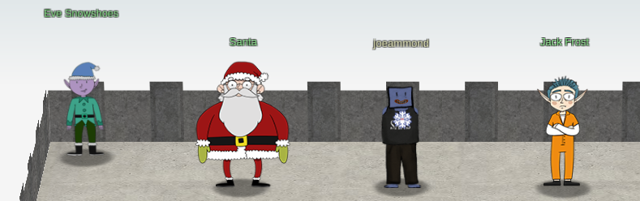

# pugpug's 2020 Holiday Hack writeups

## Conclusion

> KringleCon back at the castle, set the stage... 
> But it's under construction like my GeoCities page. 
> Feel I need a passport exploring on this platform - 
> Got half floors with back doors provided that you hack more! 
> Heading toward the light, unexpected what you see next: 
> An alternate reality, the vision that it reflects. 
> Mental buffer's overflowing like a fast food drive-thru trash can. 
> Who and why did someone else impersonate the big man? 
> You're grepping through your brain for the portrait's "JFS" 
> "Jack Frost: Santa," he's the villain who had triggered all this mess! 
> Then it hits you like a chimney when you hear what he ain't saying: 
> Pushing hard through land disputes, tryin' to stop all Santa's sleighing. 
> All the rotting, plotting, low conniving streaming from that skull. 
> Holiday Hackers, they're no slackers, returned Jack a big, old null! 

Another Holiday Hack Challenge is complete. Thank you to the entire team
who puts this on. I wish I could have covered everything in this report, but as we're
limited to 50 pages, I can't. The poem hidden in the painting of Santa, evan's "Secret
Garden", the references to last years's HHC, you'll have to find on your own.

I still haven't figured out how to get to the `steamtunnels`, but I will..

**Joe Ammond** 
[@joeammond](https://twitter.com/joeammond) 
'pugpug#6191' on Discord. 
