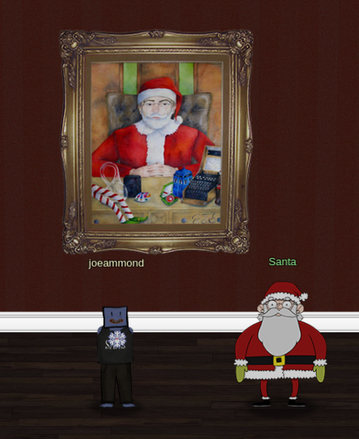
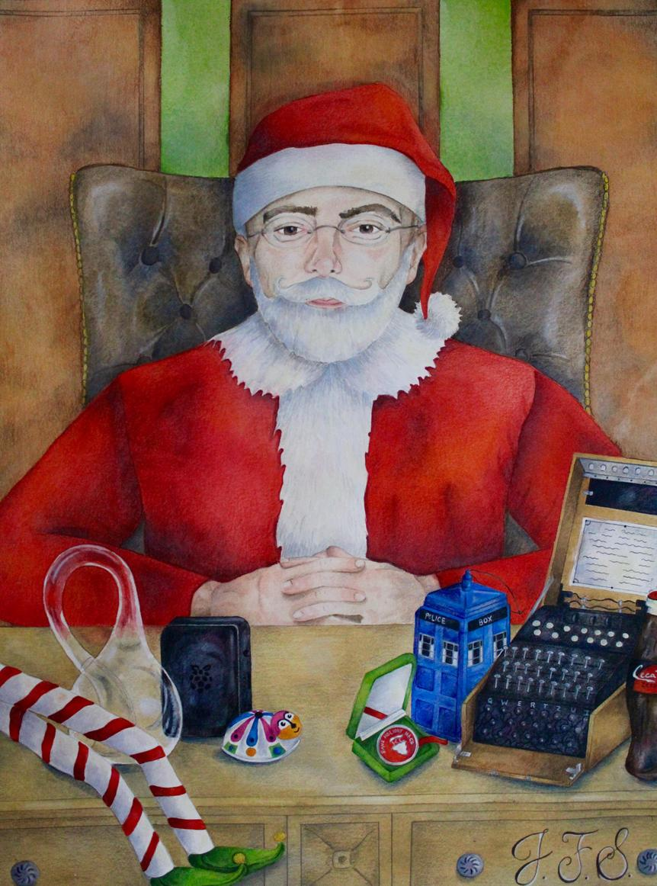
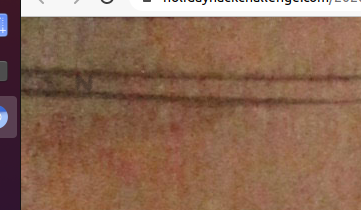
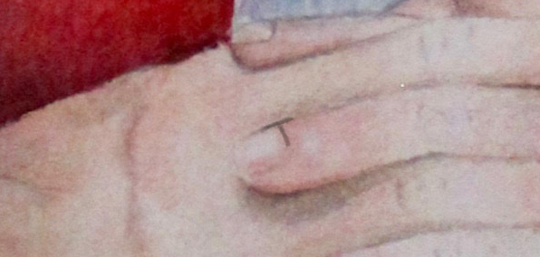
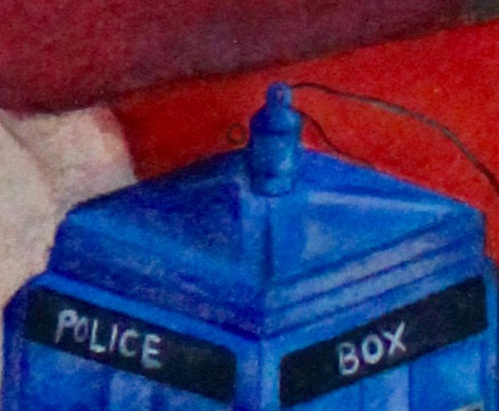

# A poem, hidden in Santa's portrait

At the back of the **Entry Hall** is a portrait of Santa:

Looking closely we can see it in more detail:

And zooming in, there are some letters hidden in the portrait:

Some of them are a bit tricky to find, but if you're patient enough,
you will find the phrase `NOW I SHALL BE OUT OF SIGHT`, a line from a
[poem](https://www.bartleby.com/400/poem/880.html) by [Hannah Flagg
Gould](https://en.wikipedia.org/wiki/Hannah_Flagg_Gould) titled [*Jack
Frost*](https://internetpoem.com/hannah-f-gould/jack-frost-poem/):

> The Frost looked forth one still, clear night, 
> And whispered, “Now I shall be out of sight; 
> So, through the valley, and over the height, 
> In silence I'll take my way. 
> I will not go on like that blustering train, 
> The wind and the snow, the hail and the rain, 
> That make such a bustle and noise in vain, 
> But I'll be as busy as they!” 
>  
> So he flew to the mountain, and powdered its crest; 
> He lit on the trees, and their boughs he drest 
> With diamonds and pearls; and over the breast 
> Of the quivering lake he spread 
> A coat of mail, that it need not fear 
> The downward point of many a spear 
> That he hung on its margin, far and near, 
> Where a rock could rear its head. 
>  
> He went to the windows of those who slept, 
> And over each pane, like a fairy, crept; 
> Wherever he breathed, wherever he stepped, 
> By the light of the morn were seen 
> Most beautiful things; there were flowers and trees; 
> There were bevies of birds and swarms of bees; 
> There were cities with temples and towers; and these 
> All pictured in silvery sheen! 
>  
> But he did one thing that was hardly fair- 
> He peeped in the cupboard, and finding there 
> That all had forgotten for him to prepare- 
> “Now, just to set them a-thinking, 
>  
> I'll bite this basket of fruit,” said he, 
> “This costly pitcher I'll burst in three; 
> And the glass of water they've left for me 
> Shall 'tchick' to tell them I'm drinking!” 

