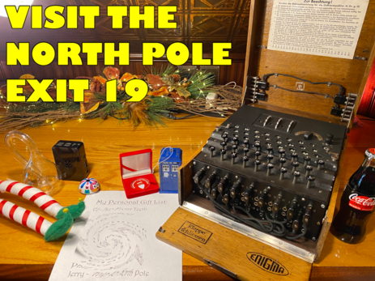
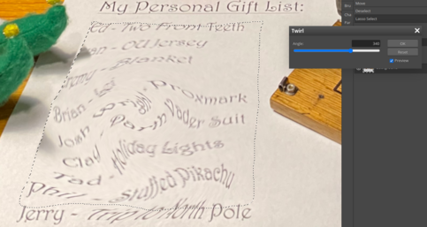

# Uncover Santa's Gift List

The first objective is a relatively simple one. It doesn't involve coding, network packet capture and analysis, or other advanced techniques that will be needed as we progress through the objectives.

## Objective

> There is a photo of Santa's Desk on that billboard with his personal gift list. What gift is Santa planning on getting Josh Wright for the holidays? Talk to Jingle Ringford at the bottom of the mountain for advice.

`Difficulty: 1/5`

## Jingle Ringford's dialog
> Welcome! Hop in the gondola to take a ride up the mountain to Exit 19: Santa's castle! 
> Santa asked me to design the new badge, and he wanted it to look really cold - like it was frosty. 
> Click your badge (the snowflake in the center of your avatar) to read your objectives. 
> If you'd like to chat with the community, join us on [**Discord**](https://discord.gg/Wbmx92rWW3)! 
> We have specially appointed Kringle Koncierges as helpers; you can hit them up for help in the #general channel! 
> If you get a minute, check out Ed Skoudis' [**official intro**](https://www.youtube.com/watch?v=8e0SZrbWFuU) to the con! 
> Oh, and before you head off up the mountain, you might want to try to figure out what's written on that advertising bilboard. 
> Have you managed to read the gift list at the center? 
> It can be hard when things are twirly. There are tools that can help! 
> It also helps to select the correct twirly area. 

## Hints
> There are [tools](https://www.photopea.com/) out there that could help Filter the Distortion that is this Twirl. 
> Make sure you Lasso the correct twirly area. 

## Solution
We can find the billboard by moving around the starting area (it may be necessary to adjust your browser's zoom level to make finding it easier). It's to above and to the left of the gondola:

We can see the list in the bottom middle of the image, but the relevant part has been swirled so as to make it unreadable. To read it, we need to import the image into an image editing tool such as Photopea from the hint above. By selecting the swirled area, we can unswirl the text, revealing the answer:

The list isn't 100% clear, but we can read the swirled list (from the bottom):

- Phil: Stuffed Pikachu
- Tad: Holiday Lights
- Clay: Darth Vader Suit
- Josh Wright: Proxmark

And there's the answer: Josh Wright wants a 'Proxmark', whatever that is.

## Answer
Josh Wright's gift: `Proxmark`
