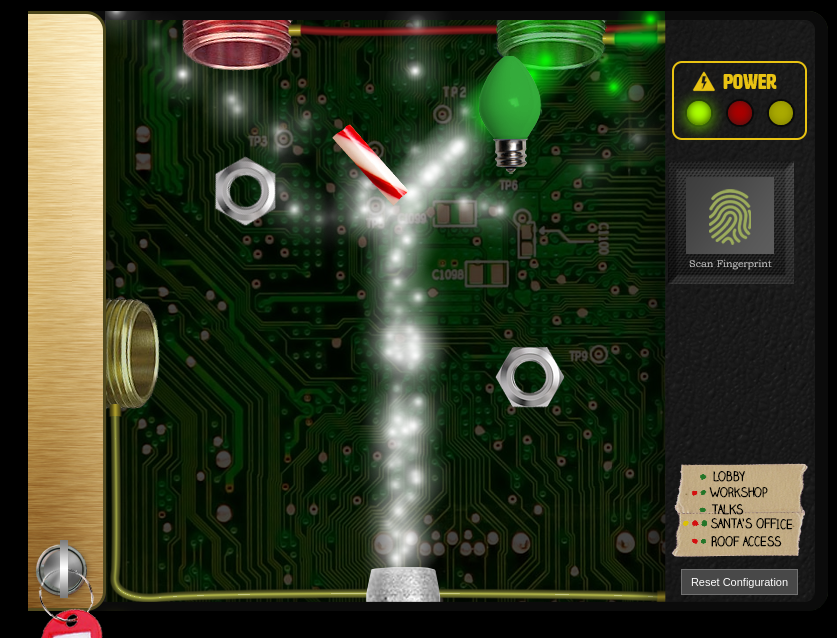
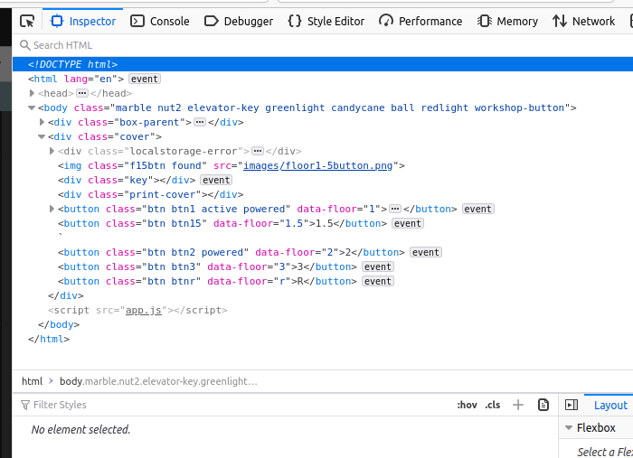
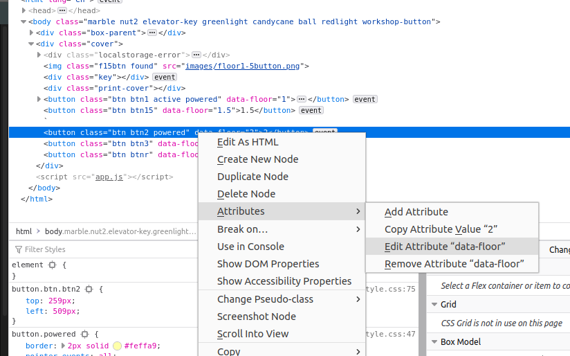

# Defeat Fingerprint Sensor

There is definitely something fishy going on in Kringle Castle. It might be time to explore Santa's office for any information on the culprit.

## Objective

> Bypass the Santavator fingerprint sensor. Enter Santa's office without Santa's fingerprint.

`Difficulty: 3/5`

## Solution

Looking at the code that runs the elevator, we see that `btn4` (the button for **Santa's Office**) has a different function that handles click() events:

```javascript linenums="349" hl_lines="6"
const handleBtn4 = () => {
  const cover = document.querySelector('.print-cover');
  cover.classList.add('open');

  cover.addEventListener('click', () => {
    if (btn4.classList.contains('powered') && hasToken('besanta')) {
      $.ajax({
        type: 'POST',
        url: POST_URL,
        dataType: 'json',
        contentType: 'application/json',
        data: JSON.stringify({
          targetFloor: '3',
          id: getParams.id,
        }),
        success: (res, status) => {
          if (res.hash) {
            __POST_RESULTS__({
              resourceId: getParams.id || '1111',
              hash: res.hash,
              action: 'goToFloor-3',
            });
          }
        }
      });
    } else {
      __SEND_MSG__({
        type: 'sfx',
        filename: 'error.mp3',
      });
    }
  });
};
```

Of particular note are the checks on line 5: a check to see that the button has a
class `powered`, and that the user has a token `besanta`. Solving the `hasToken('besanta')`
check is simple: the function `hasToken` checks for the existance of an item in the
`tokens` list. In the JavaScript console, we can add `besanta` to `tokens` with `tokens.push('besanta')`.

Solving the `powered` is a bit trickier. The `powered` class is added to the button by the function `renderTraps()`, called inside a continually-updating event loop for drawing the Sparkle Stream on the screen. Manually adding `powered` as a class to the button, or modifying the `powered[]` object in the JavaScript console results in the `powered` state being removed. One can build a rather convoluted method to split and color the Sparkle Stream:


But there is a simpler solution: power a single receiver, such as the green one:



Then change what floor the button sends us to when it is clicked. Open the elevator
panel, make sure the green receiver is powered, then open the Developer tools. In the
Inspector tab, find the one of the buttons that has the `powered` class:



Then, edit the `data_floor` attribute to be `3` (the floor number of Santa's Office):



Click the modified button, and you'll be taken to Santa's Office.

## Answer
Visit Santa's Office.
