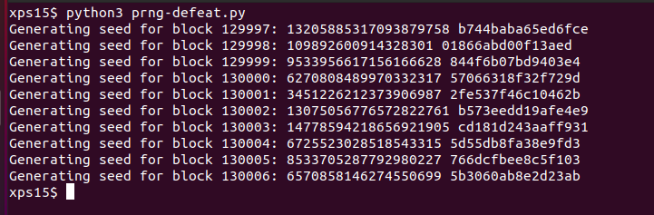

# Objective 11a: Naughty/Nice List with Blockchain Investigation Part 1

> Even though the chunk of the blockchain that you have ends with block 129996, can you predict the nonce for block 130000? Talk to Tangle Coalbox in the Speaker UNpreparedness Room for tips on prediction and Tinsel Upatree for more tips and [tools](https://download.holidayhackchallenge.com/2020/OfficialNaughtyNiceBlockchainEducationPack.zip). (Enter just the 16-character hex value of the nonce)

> `Difficulty: 5/5`

## Hints
> If you have control over to bytes in a file, it's easy to create MD5 [hash collisions](https://github.com/corkami/collisions). Problem is: there's that nonce that he would have to know ahead of time.</br>

## Solution

These last two objectives are the most difficult in the entire challenge. We're given
a shard of Santa's "Naughty/Nice" blockchain, and Python code that allows to process
the chain and individual blocks contained within. Watching Professor Qwerty Petabyte's
[talk](https://www.youtube.com/watch?v=7rLMl88p-ec) on the Naughty/Nice blockchain is
essential to understanding this objective.

In this objective, we're tasked with finding the `nonce` for a block beyond the end of the
blockchain shard we've been given. The `nonce` is a 64-bit random value added to the beginning of
each block to avoid hash collisions in the MD5 hash algorithm used for verifying the integrity
of the blockchain:

```python
self.index = index
if self.index == 0:
    self.nonce = 0 # genesis block
else:
    self.nonce = random.randrange(0xFFFFFFFFFFFFFFFF)
```

The first block in a chain (the 'genesis block') has a nonce of zero,
whereas any subsequent block has a random 64-bit value added, generated from
Python's `random.randrange()` function.  However, from watching Tom Liston's
[talk](http://www.youtube.com/watch?v=Jo5Nlbqd-Vg) on how the Pseudo-Random Number Generator
"Mersenne Twister" generates numbers, we know if we have 624 consecutive numbers from the PRNG we
can clone the state of the generator and use the clone to predict what the PRNG output will be. 

One challenge is that the implementation of the Mersenne Twister in Python returns 32-bit
results, but the `nonce` generated for the block is a 64-bit value. To determine how the
Python function `randrange()` generates randum values with >32 bits, we have to dig into the 
source for the Python `random` library. In [https://github.com/python/cpython/blob/master/Lib/random.py](https://github.com/python/cpython/blob/master/Lib/random.py), we can find the definition for
the function `randrange()` starting at line 292: After some boilerplate type and argument
checking, the relevant call to get random data is:

```python
if istep > 0:
    n = (width + istep - 1) // istep
elif istep < 0:
    n = (width + istep + 1) // istep
else:
    raise ValueError("zero step for randrange()")
if n <= 0:
    raise ValueError("empty range for randrange()")
return istart + istep * self._randbelow(n)
```

`n` is the upper limit of value to return. So `randrange` calls `_randbelow`:

```python
def _randbelow_with_getrandbits(self, n):
    "Return a random int in the range [0,n).  Returns 0 if n==0."

    if not n:
        return 0
    getrandbits = self.getrandbits
    k = n.bit_length()  # don't use (n-1) here because n can be 1
    r = getrandbits(k)  # 0 <= r < 2**k
    while r >= n:
        r = getrandbits(k)
    return r
```

The source to `getrandbits` is in [https://github.com/python/cpython/blob/master/Modules/_randommodule.c](https://github.com/python/cpython/blob/master/Modules/_randommodule.c):

```c
/*[clinic input]
_random.Random.getrandbits
  self: self(type="RandomObject *")
  k: int
  /
getrandbits(k) -> x.  Generates an int with k random bits.
[clinic start generated code]*/

static PyObject *
_random_Random_getrandbits_impl(RandomObject *self, int k)
/*[clinic end generated code: output=b402f82a2158887f input=8c0e6396dd176fc0]*/
{
    int i, words;
    uint32_t r;
    uint32_t *wordarray;
    PyObject *result;

    if (k < 0) {
        PyErr_SetString(PyExc_ValueError,
                        "number of bits must be non-negative");
        return NULL;
    }

    if (k == 0)
        return PyLong_FromLong(0);

    if (k <= 32)  /* Fast path */
        return PyLong_FromUnsignedLong(genrand_uint32(self) >> (32 - k));

    words = (k - 1) / 32 + 1;
    wordarray = (uint32_t *)PyMem_Malloc(words * 4);
    if (wordarray == NULL) {
        PyErr_NoMemory();
        return NULL;
    }

    /* Fill-out bits of long integer, by 32-bit words, from least significant
       to most significant. */
#if PY_LITTLE_ENDIAN
    for (i = 0; i < words; i++, k -= 32)
#else
    for (i = words - 1; i >= 0; i--, k -= 32)
#endif
    {
        r = genrand_uint32(self);
        if (k < 32)
            r >>= (32 - k);  /* Drop least significant bits */
        wordarray[i] = r;
    }

    result = _PyLong_FromByteArray((unsigned char *)wordarray, words * 4,
                                   PY_LITTLE_ENDIAN, 0 /* unsigned */);
    PyMem_Free(wordarray);
    return result;
}
```

The relevant code for returning random values >32-bits long is in the `for()` loop: 32-bit random
values are generated, then filled into an array least-significant bits to most-significant bits. 
The `nonce` values therefore are the result of two calls to the PRNG for 32-bit values, the
second shifted 32 bits and added to the first. This is equivalent to `random.randrange(0xFFFFFFFFFFFFFFFF)`.

```python
r1 = random.randrange(0xFFFFFFFF)
r2 = random.randrange(0xFFFFFFFF)

nonce = ((r2<<32) + r1)
```

Armed with this, we can write some code to:

- Retrieve all the `nonce` values from the blockchain shard
- Split each 64-bit value into it's 32-bit components
- Use the last 624 values to re-create the Python PRNG state
- Run our PRTG forward and generate `nonce` values for blocks, until we reach block `130000`

Copying `blockchain.dat`, `naughty_nice.py`, `official_public.pem` and `mt19937.py` to a directory,
we can run the following Python code to do the above:

```python
#!/usr/bin/env python3

# (c) 2020 Joe Ammond 'pugpug' (@joeammond)

from mt19937 import mt19937, untemper
from naughty_nice import Chain, Block

# Load the blockchain shard
shard = Chain(load=True, filename='blockchain.dat')

# Pull all the nonces from the blockchain, split them into their
# component 32-bit values, and append them to the list of seeds
prng_seeds = []
for index in range(len(shard.blocks)):
    nonce = shard.blocks[index].nonce
    r1 = nonce & 0xFFFFFFFF
    r2 = nonce >> 32
    prng_seeds.append(r1)
    prng_seeds.append(r2)

# Create our own version of an MT19937 PRNG.
myprng = mt19937(0)

# Pull the last 624 seeds for the PRNG
prng_seeds = prng_seeds[-624:]

# Seed our PRNG
for index in range(len(prng_seeds)):
    myprng.MT[index] = untemper(prng_seeds[index])

# Print the next 10 block nonces. We want the hex value for block 130000
for index in range(10):
    print('Generating seed for block {}: '.format(index + 129997), end='')

    r1 = myprng.extract_number()
    r2 = myprng.extract_number()
    nonce = ((r2<<32) + r1)

    print(nonce, '%016.016x' % (nonce))
```

Running this code produces the following output:



The hexadecimal value for block `130000` is `57066318f32f729d`.

## Answer
`57066318f32f729d`
