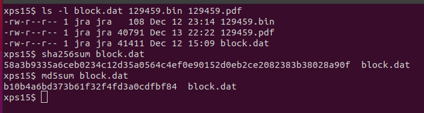
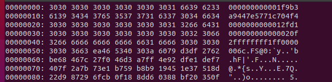
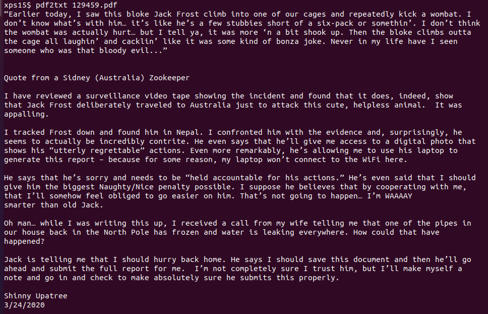
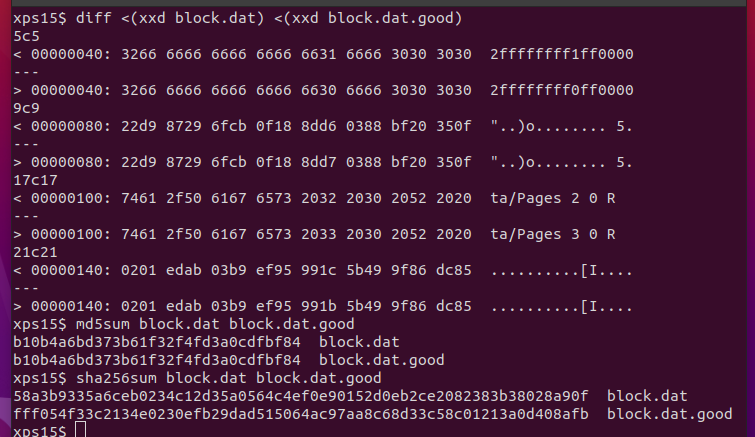

# Objective 11b: Naughty/Nice List with Blockchain Investigation Part 2

> The SHA256 of Jack's altered block is: 58a3b9335a6ceb0234c12d35a0564c4e f0e90152d0eb2ce2082383b38028a90f. If you're clever, you can recreate the original version of that block by changing the values of only 4 bytes. Once you've recreated the original block, what is the SHA256 of that block?

> `Difficulty: 5/5`

## Solution

> *But we in it shall be remembered-we few, we happy few, we band of brothers; for he
> today that finishes 11b with me shall be my brother, be he ne'er so vile...*

11b.

The premise was simple: find the block that contains the data on Jack, change
4 bytes in it to display the original data, all while the MD5 hash of the block
remained unchanged.  We're given some hints: Jack used a type of hash collision
called **[UNICOLL](https://speakerdeck.com/ange/colltris?slide=109)**. Jack's score
was originally overwhelmingly negative and is now overwhelmingly positive. And, Shinny
Upatree swears he didn't write the PDF document attached to Jack's block.

Finding the block isn't difficult: creating a list of scores of the blocks in the chain
shows one block with a score of `ffffffff (4294967295)`, which matches what we learned
from Tinsel Upatree about Jack's score. The block in question also has two documents,
one of which is a very large PDF attachment. Dumping the block and the individual
attachments shows that the block matches the SHA256 hash in the objective, so we know
we've identified the block with Jack's data.



Now that we've identified the block, let's take a look at the data in the block. We can
understand the data format of the block from the Python code:

```python
def load_a_block(self, fh):
    self.index = int(fh.read(16), 16)
    self.nonce = int(fh.read(16), 16)
    self.pid = int(fh.read(16), 16)
    self.rid = int(fh.read(16), 16)
    self.doc_count = int(fh.read(1), 10)
    self.score = int(fh.read(8), 16)
    self.sign = int(fh.read(1), 10)
    count = self.doc_count
    while(count > 0):
        l_data = {}
        l_data['type'] = int(fh.read(2),16)
        l_data['length'] = int(fh.read(8), 16)
        l_data['data'] = fh.read(l_data['length'])
        self.data.append(l_data)
        count -= 1
```

We can take a look at the block with `xxd`:



Starting at byte `0x40 (64)`, we can decode the block this way:

- `doc_count = 2`
- `score = ffffffff`
- `sign = 1`

The next set of bytes are the attached documents. The first is of type `0xff (255)`, which
is defined as `255:'Binary blob'` in `naughty_nice.py`. Examining the attachment shows
that it appears to be completely random data.

From the [CollTris presentation](https://speakerdeck.com/ange/colltris), we know that in a
UNICOLL collision, the 10th character in the prefix block is incremented by 1, while the 10th
character in the next block is decremented by 1. In the Naughty/Nice blockchain, the 10th
character in the second block of 64 bytes is the `sign`, which determines whether the score is
`naughty (0)` or `nice (1)`. Jack was able to change the `sign` from `0 -> 1`, also changing
the 10th byte in the next 64-byte segment, in the binary blob of 'random' data. Reversing those
changes with a hex editor allows us to fix Jack's score, while the MD5 hash of the block
remains unchanged. 

The second set of changed bytes is in the attached PDF. Viewing the PDF shows almost
identical statements from various people, all attesting that Jack Frost is the most
wonderful person on the planet. Shinny Upatree, however, swears that this isn't what he
wrote for the event. We can use a tool like `pdf2txt` to extract all of the text from
the PDF and see what is hidden:



Hidden in the PDF is the actual text Shinny wrote, where we see that Jack had access to
the report and blockchain submission system. Using a tool that creates [collisions in PDF
files](https://github.com/corkami/collisions#pdf), Jack was able to hide his fake report
inside the one submitted[^1]. We can reverse this by reversing the results of the tool
with a hex editor on the block: by incrementing `Pages 2` and decrementing the corresponding
byte in the next block. `diff` shows the changes between the original and 'good' block, while
the MD5 remains the same. The SHA256 hashes, however, are different:



The SHA256 hash of the 'good' block is `fff054f33c2134e0230efb29dad515064ac97aa8c68d33c58c01213a0d408afb`.

[^1]: I may have used this technique on this PDF as well...

## Answer
`fff054f33c2134e0230efb29dad515064ac97aa8c68d33c58c01213a0d408afb`
