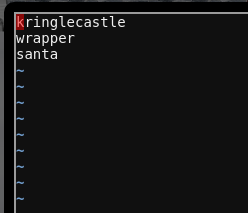
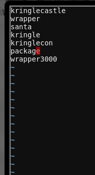
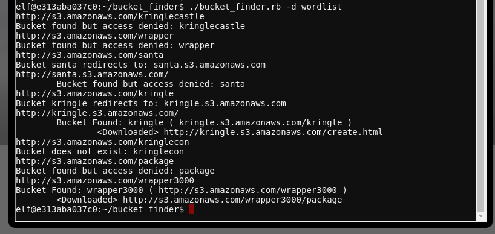
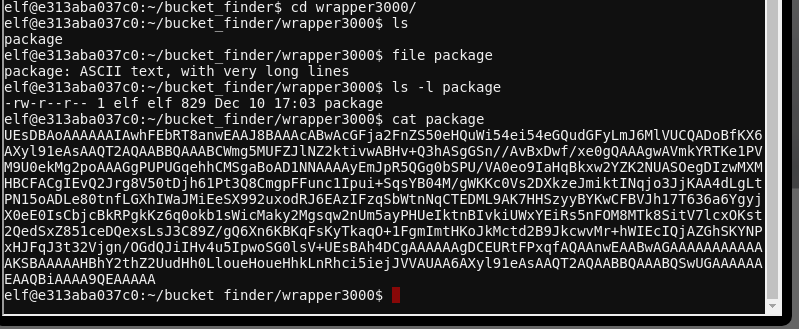
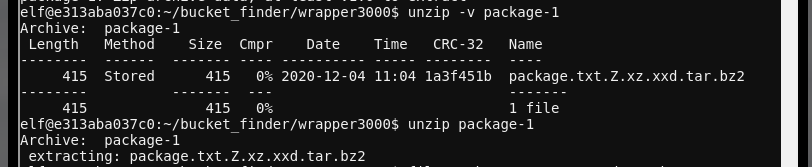
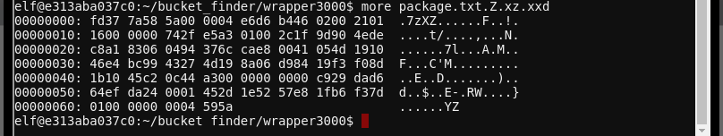
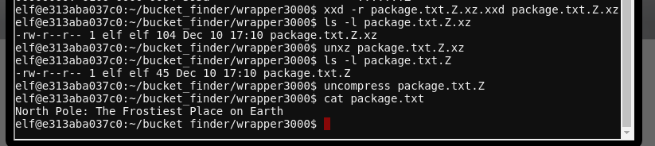

# Investigate S3 Bucket

This objective involves two distinct parts: finding a unpotected S3 storage bucket,
then determining the content of the bucket.

## Objective

> When you unwrap the over-wrapped file, what text string is inside
> the package? Talk to Shinny Upatree in front of the castle for hints on
> this challenge.

`Difficulty: 1/5`

## Shinny Upatree's dialog
> Hiya hiya - I'm Shinny Upatree!</br>
> Check out this cool KringleCon kiosk!</br>
> You can get a map of the castle, learn about where the elves are, and get your own badge printed right on-screen!</br>
> Be careful with that last one though. I heard someone say it's "ingestible." Or something...</br>
> Do you think you could check and see if there is an issue?</br>

## Hints
> It seems like there's a new story every week about data exposed through unprotected [Amazon S3 buckets](https://www.computerweekly.com/news/252491842/Leaky-AWS-S3-bucket-once-again-at-centre-of-data-breach).</br>
> Robin Wood wrote up a guide about [finding these open S3 buckets](https://digi.ninja/blog/whats_in_amazons_buckets.php).</br>
> He even wrote a tool to [search for unprotected buckets](https://digi.ninja/projects/bucket_finder.php)!</br>
> Find Santa's `package` file from the cloud storage provider. Check Josh Wright's [talk](https://www.youtube.com/watch?v=t4UzXx5JHk0) for more tips!</br>
> Santa's Wrapper3000 is pretty buggy. It uses several compression tools, binary to ASCII conversion, and other tools to wrap packages.</br>

## Solution
To find the unprotected S3 bucket, we'll use the tool `bucket_finder` installed on the terminal labeled `Investigate S3 Bucket`. There is a sample wordlist included in the `bucket_finder` directory:



Unfortunately, running `bucket_finder -d wordlist` doesn't find the relevant data, so we'll need do some guesswork on what the bucket we're looking for will be named. We try a few guesses, based on the hints and dialog:



And have some success:



The `-d` flag passed to `bucket_finder` specifies that we want any content in the bucket downloaded locally. We see it downloaded the file `package` from `http://s3.amazonaws.com/wrapper3000`. Let's see what's in it:



It's base64-encoded data. We can decode it with `base64 -d package > package-1`. Running `file package-1` shows that it's a .ZIP file. Checking the content of the ZIP file reveals a very strangely named file:



From the list of extensions on the file, we'll need to use the following utilities to extract the file:

```
1. bunzip2
2. tar
3. xxd
4. unxz
5. uncompress
```

`xxd` may not be familiar to some users. It's a tool for displaying files as hexdump, or re-creating a binary file from a hexdump:



We use `xxd -r` to re-create the .xz file, and proceed to extract the final `package.txt` and see it's contents for the objective:




## Answer
`North Pole: The Frostiest Place on Earth`
