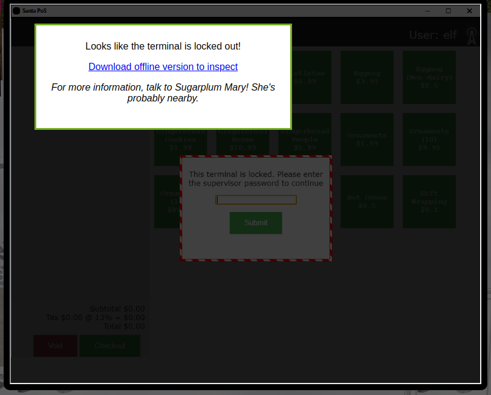
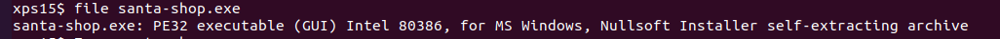
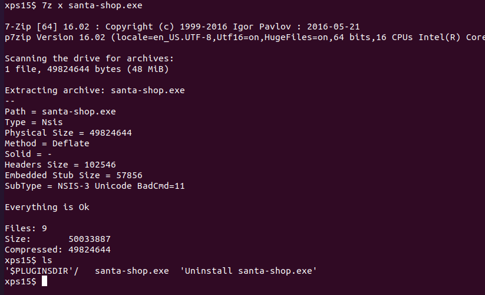
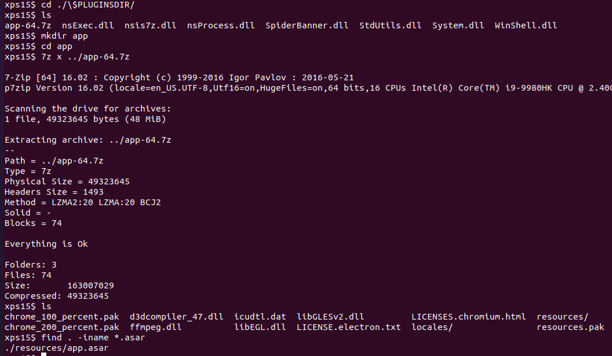
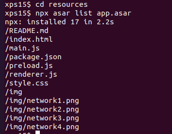
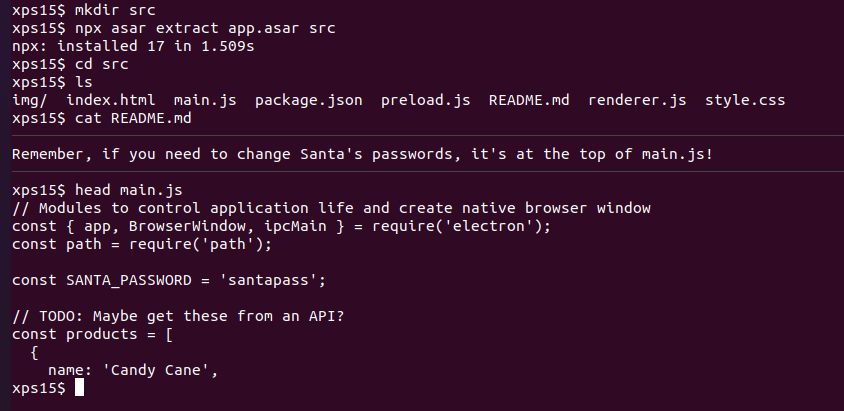

# Point-of-Sale Password Recovery

In this objective, we'll be pulling apart an application to find a hardcoded password. To get the hints, complete the **Linux Primer** terminal first.

## Objective

> Help Sugarplum Mary in the Courtyard find the supervisor password for the point-of-sale terminal. What's the password?

`Difficulty: 1/5`

## Sugarplum Mary's dialog:
> Hey, wouldja' mind helping me get into my point-of-sale terminal? 
> It's down, and we kinda' need it running. 
> Problem is: it is asking for a password. I never set one! 
> Can you help me figure out what it is so I can get set up? 
> Shinny says this might be an Electron application. 
> I hear there's a way to extract an ASAR file from the binary, but I haven't looked into it yet. 

## Hints
> It's possible to extract the source code from an [Electron](https://www.electronjs.org/) app. 
> There are [tools](https://www.npmjs.com/package/asar) and [guides](https://medium.com/how-to-electron/how-to-get-source-code-of-any-electron-application-cbb5c7726c37) explaining how to extract ASAR from Electron apps. 

## Solution
[Electron](https://www.electronjs.org/) is a framework for developing native applications with
web technologies such as JavaScript, HTML, and CSS. From the
[guide](https://medium.com/how-to-electron/how-to-get-source-code-of-any-electron-application-cbb5c7726c37)
on medium, it's possible to extract the source code of the application. We'll use the guide
as a basis to finding and viewing the source code to the **Santa Shop** application.

Opening the **Santa Shop** terminal displays the following screen:

We're presented with a link to download the application for offline analysis. Downloading the file and running the `file` command on it gives us some details on what type of application we're dealing with:

The important piece of information `file` returned is `Nullsoft Installer self-extracting archive`. While we could transfer the executable to a Windows machine and run the installer, it's easier to use a tool like `7zip` to just extract the installation files:

This gives us the installer files, but unfortunately we don't yet have the
`.asar` file that contains the application source. Looking in the `$PLUGINSDIR`
directory, there is a `app-64.7z` file which looks promising. Let's create
a directory to store it's contents, extract it with `7-zip`, and use the
`find` command to look for any `.asar` files:

Aha, there is a file `app.asar` in the `resources` directory. From the guide, we need to use the [`asar`](https://github.com/electron/asar) utility from `node.js` to work with the file. After installing `node.js` and adding the `asar` command, we can run `npx asar list` command on `app.asar` to see a list of the application source code:

`npx asar extract {filename} {directory}` is used to extract the source files from `{filename}` into `{directory}`. Extracting the source to a `src` directory and viewing the `README.md` tells us that the password is at the top of the file `main.js`:

And there is Santa's password, in cleartext in the application source code.

## Answer
`santapass`
