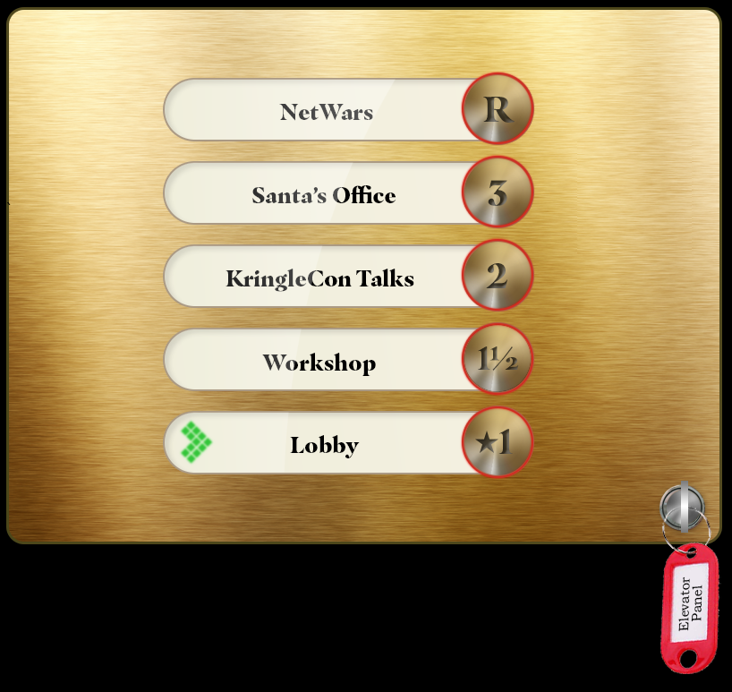
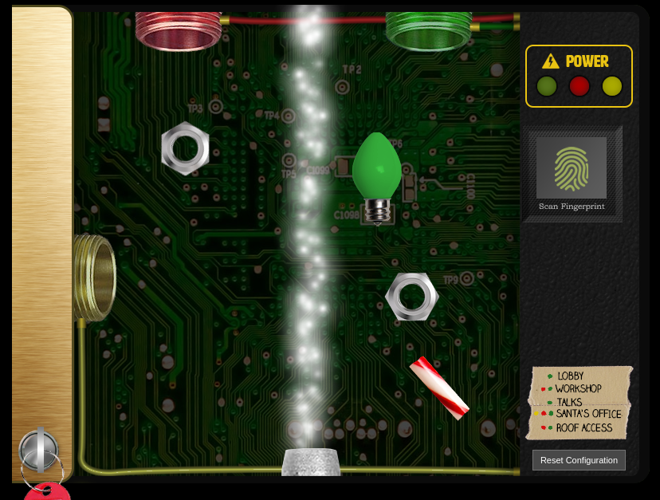
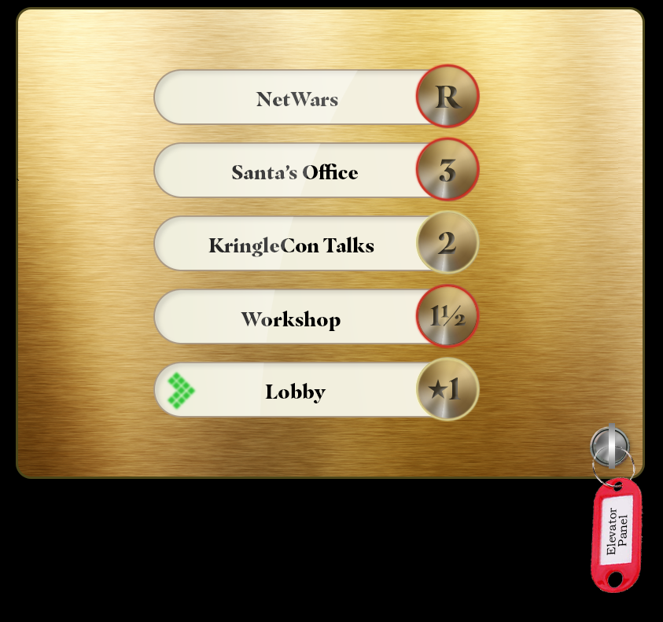
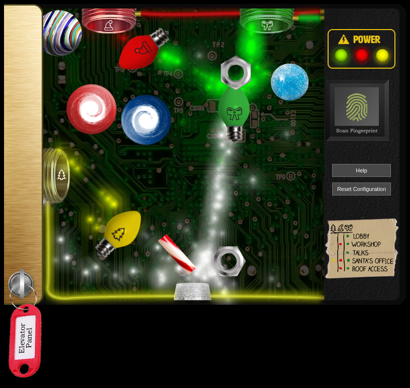
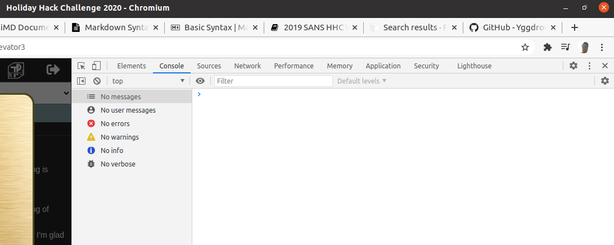
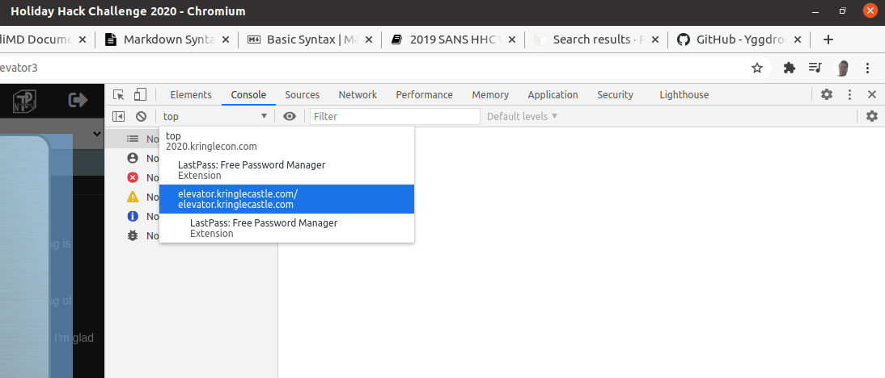
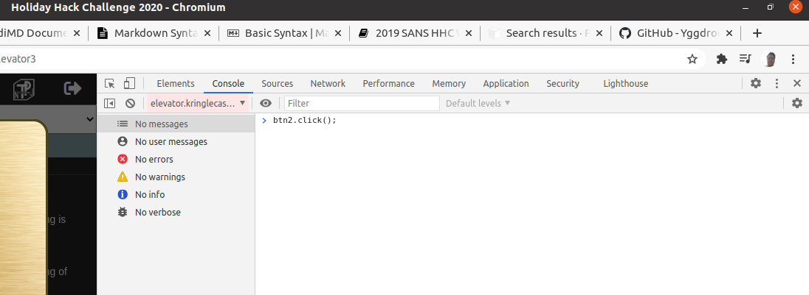

# Operate the Santavator

Our next objective is to fix and operate the **Santavator**, an elevator that gives access to additional floors in Kringle Castle.

## Objective

> Talk to Pepper Minstix in the entryway to get some hints about the Santavator.

`Difficulty: 2/5`

## Pepper Mintstix dialog:
> There's a Santavator that moves visitors from floor to floor, but it's a bit wonky.</br>
> You'll need a key and other odd objects. Try talking to Sparkle Redberry about the key.</br>
> For the odd objects, maybe just wander around the castle and see what you find on the floor.</br>
> Once you have a few, try using them to split, redirect, and color the Super Santavator Sparkle Stream (S4).</br>
> You need to power the red, yellow, and green receivers with the right color light!</br>

## Sparkle Redberry's dialog:
> Hey hey, Sparkle Redberry here!<br>
> The Santavator is on the fritz. Something with the wiring is grinchy, but maybe you can rig something up?<br>
> Here's the key! Good luck!<br>
> On another note, I heard Santa say that he was thinking of canceling KringleCon this year!<br>
> At first, I thought it was a joke, but he seemed serious. I’m glad he changed his mind.<br>
> Have you had a chance to look at the Santavator yet?<br>
> With that key, you can look under the panel and see the Super Santavator Sparkle Stream (S4).<br>
> To get to different floors, you'll need to power the various colored receivers.<br>
> ... There MAY be a way to bypass the S4 stream.<br>

## Hints
> It's really more art than science. The goal is to put the right colored light into the receivers on the left and top of the panel.</br>

## Solution

In the top-right corner of the courtyard you'll find the elf Sparkle Redberry standing next to the **Santavator**, a magic-powered elevator. He'll give you a key to open the operator panel in the Santavator:



Also, in your wanderings around the castle, you've probably seen and picked up some random items laying on the floor (a candycane in the entryway of the castle, for example). Those items will be behind the operator panel, which opens by clicking on the key:



The legend in the bottom-right corner shows what color receiver needs to be "powered" for the button for that floor to be active. For example, powering the green receiver will allow access to the **Lobby** and the **KringleCon Talks** floors. The collected items can be dragged around to split, direct, and change the colors of the Sparkle Stream. For example, this configuration will power the green receiver:


Closing the panel with the Sparkle Stream in that configuration now allows access to floor 2 (KringleCon talks):



Visiting any floor other than the Lobby will fulfill the objective. Eventually more objects can be found around the castle, and with much creative moving of objects, all the receiver can be powered:



There is a simpler way, that doesn't involve any objects, splitting Sparkle streams, and powered receiver. The answer lies in the source code to the Santavator application, and why client-side security checks can be a bad idea.

The application that controlls the Santavator is an embedded iframe in the browser window. The application source is at [https://elevator.kringlecastle.com/app.js](https://elevator.kringlecastle.com/app.js). Of interest are the following blocks of JavaScript:

```javascript linenums="326"
const handleBtn = event => {
  const targetFloor = event.currentTarget.attributes['data-floor'].value;
  $.ajax({
    type: 'POST',
    url: POST_URL,
    dataType: 'json',
    contentType: 'application/json',
    data: JSON.stringify({
      targetFloor,
      id: getParams.id,
    }),
    success: (res, status) => {
      if (res.hash) {
        __POST_RESULTS__({
          resourceId: getParams.id || '1111',
          hash: res.hash,
          action: `goToFloor-${targetFloor}`,
        });
      }
    }
  });
}
```

```javascript linenums="383"
const btn1 = document.querySelector('button[data-floor="1"]');
const btn2 = document.querySelector('button[data-floor="1.5"]');
const btn3 = document.querySelector('button[data-floor="2"]');
const btn4 = document.querySelector('button[data-floor="3"]');
const btnr = document.querySelector('button[data-floor="r"]');

btn1.addEventListener('click', handleBtn);
btn2.addEventListener('click', handleBtn);
btn3.addEventListener('click', handleBtn);
btn4.addEventListener('click', handleBtn4);
btnr.addEventListener('click', handleBtn);
```

The `handleBtn` function is called when any of the buttons are clicked on, with the appropriate floor data (ignoring `handleBtn4` for now). We can simulate a click on the button in the browser's JavaScript console using `btnX.click()`. Open the browsers `Developer Tools` menu and go to the `Console` tab (`Google Chrome` shown):



Because the Santavator code is an iFrame, it runs in a separate JavaScrpt context from the main page. In Chrome, that context can be selected via the dropdown menu at the top-left of the tools:



Switch the context to `elevator.kringlecastle.com`, and enter `btnX.click();` at the `> ` prompt. You'll be taken to the floor associated with the button.



## Answer
Visit any floor other than the Lobby to fulfill this objective.
