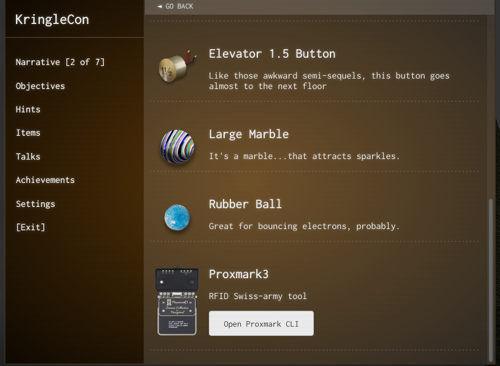
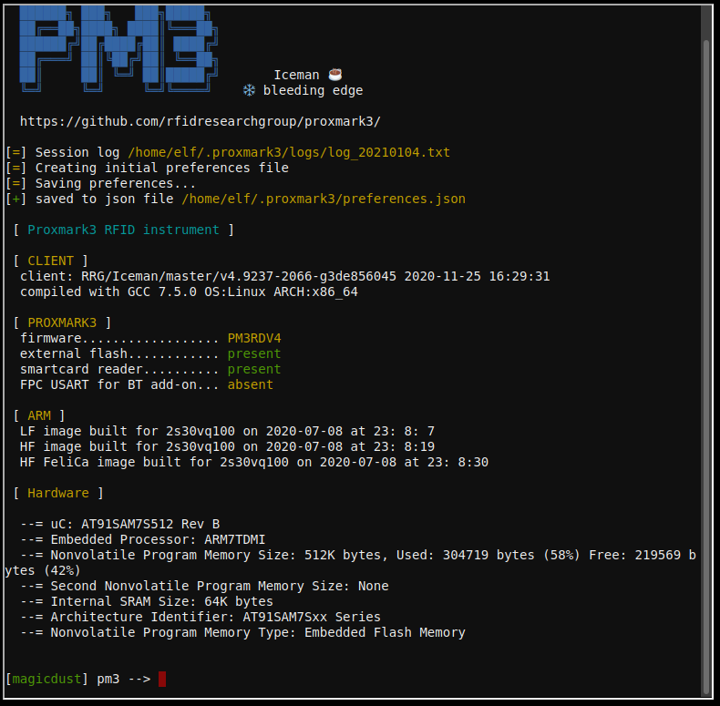
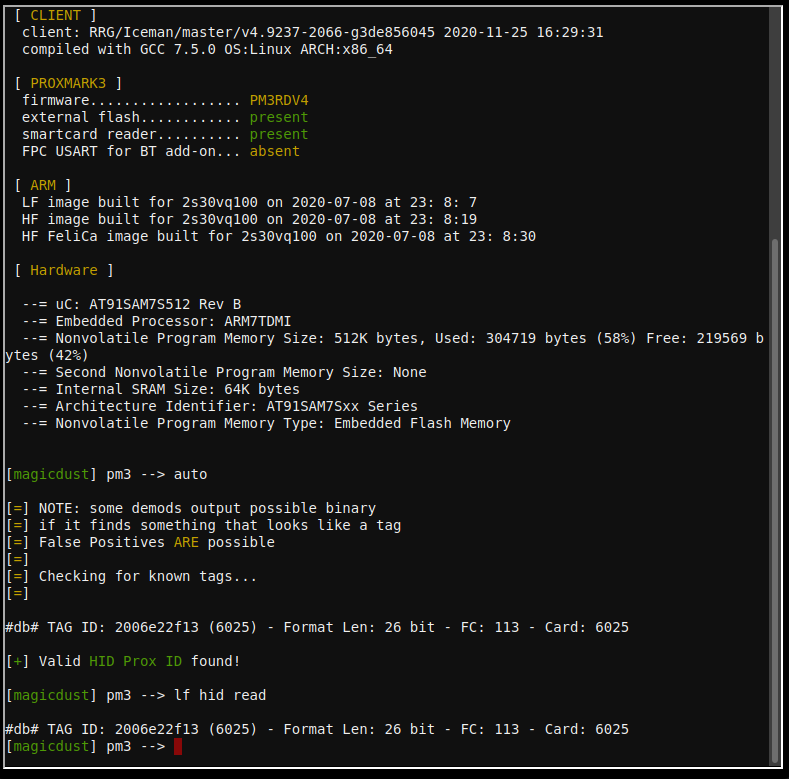
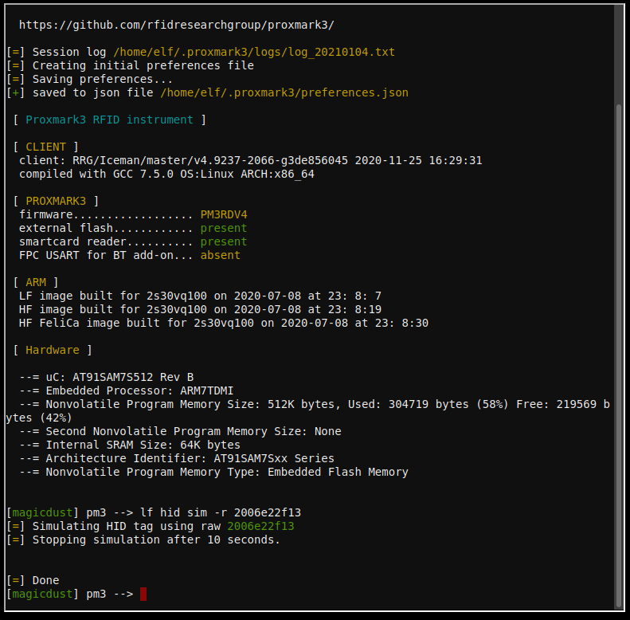

# Open HID lock

We're able to go to the different floors in the castle now, but there's a door we can't access: the locked door in the **Workshop**.

## Objective

> Open the HID lock in the Workshop. Talk to Bushy Evergreen near the talk tracks for hints on this challenge. You may also visit Fitzy Shortstack in the kitchen for tips.

`Difficulty: 2/5`

## Bushy Evergreen's dialog:
> Oh, this might be a good time to mention another lock in the castle. 
> Santa asked me to ask you to evaluate the security of our new HID lock. 
> If ever you find yourself in posession of a Proxmark3, click it in your badge to interact with it. 
> It's a slick device that can read others' badges! 
> Oh, did I mention that the Proxmark can simulate badges? Cool, huh? 
> There are lots of references online to help. 
> In fact, there's [a talk](https://www.youtube.com/watch?v=647U85Phxgo) going on right now! 
> And that Proxmark thing? Some people scan other people's badges and try those codes at locked doors. 
> Other people scan one or two and just try to vary room numbers. 
> Do whatever works best for you! 

## Fizzy Shortstack's dialog:
> You know, Santa really seems to trust Shinny Upatree... 

## Hints
> The Proxmark is a multi-function RFID device, capable of capturing and replaying RFID events. 
> Larry Pesce knows a thing or two about [HID attacks](https://www.youtube.com/watch?v=647U85Phxgo). He's the author of a course on wireless hacking! 
> There's a [short list of essential Proxmark commands](https://gist.github.com/joswr1ght/efdb669d2f3feb018a22650ddc01f5f2) also available. 
> You can also use a Proxmark to impersonate a badge to unlock a door, if the badge you impersonate has access. `lf hid sim -r 2006......` 
> You can use a Proxmark to capture the facility code and ID value of HID ProxCard badge by running `lf hid read` when you are close enough to someone with a badge. 

## Solution

!!! note
    To get the full dialog from Bushy, we'll need to complete the **Speaker UNPrep** terminal next to him. Additionally, by completing Fizzy Shortstack's modem task, we get a valuable clue to opening the door.

Once we have access to the Workshop via the Santavator, in the wrapping room in the back on the floor is a **Proxmark3**. A Proxmark3 is a device used by penetration to scan for, read, and replay RFID data. It's most common use in penetration tests is to read and spoof access badges/tags to enter secured areas. In this case, we're going to use it to become a trusted elf that has access to the locked room in the Workshop. From Fizzy Shortstack, we learn that Santa really trusts Shinny Upatree. He may trust him enough to allow him access to the locked room. 

A Proxmark reader only has a limited range, so it's essential to be close to the badge we're trying to read. After moving to the Courtyard, stand close to Shinny and bring up your item list in your badge:

and then open the Proxmark console:

A short list of essential Proxmark commands is [here](https://gist.github.com/joswr1ght/efdb669d2f3feb018a22650ddc01f5f2). We scan for any RFID devices in the local area by `auto` or `lf hid read`:

We see that Shinny Shortstack's badge is `TAG ID: 2006e22f13 (6025) - Format Len: 26 bit - FC: 113 - Card: 6025`. Using the `TAG ID`, we can now spoof Shinny's badge as if we were him. By standing next to the badge reader next to the locked door in the Workshop, we can use the `lf hid sim` command to simulate Shinny's badge:

And that completes the objective. If we're curious, we could scan the other individuals in the castle to build a database of all the badges:

Once the door opens, enter the locked room to open the remaining objectives.

## Answer
`Simulate Shinny Upatree's badge to open the locked door`
