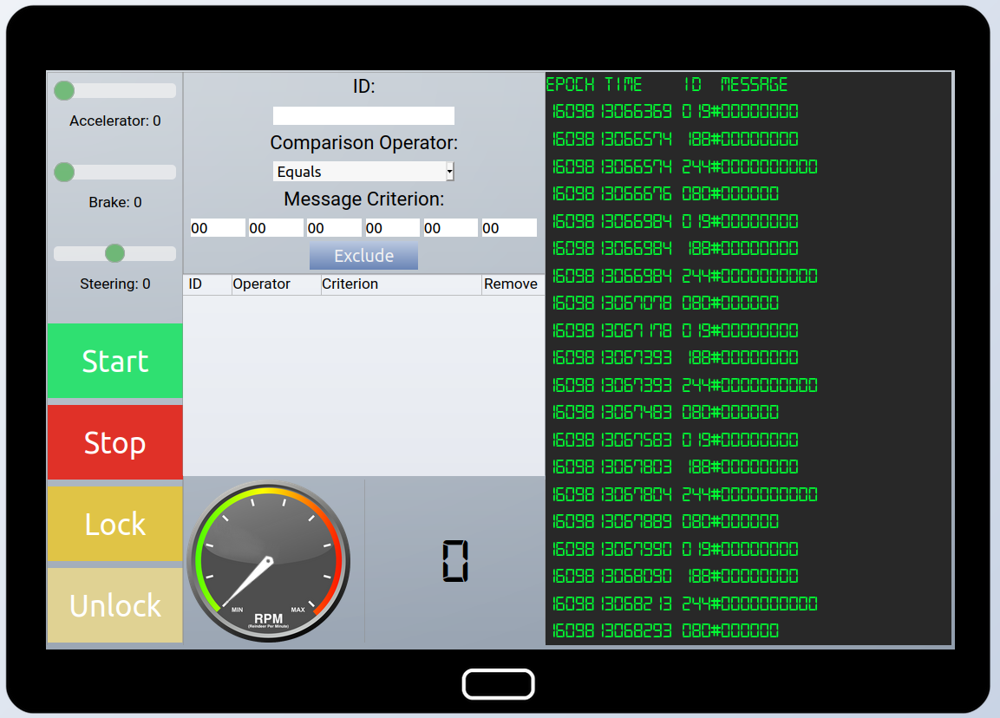
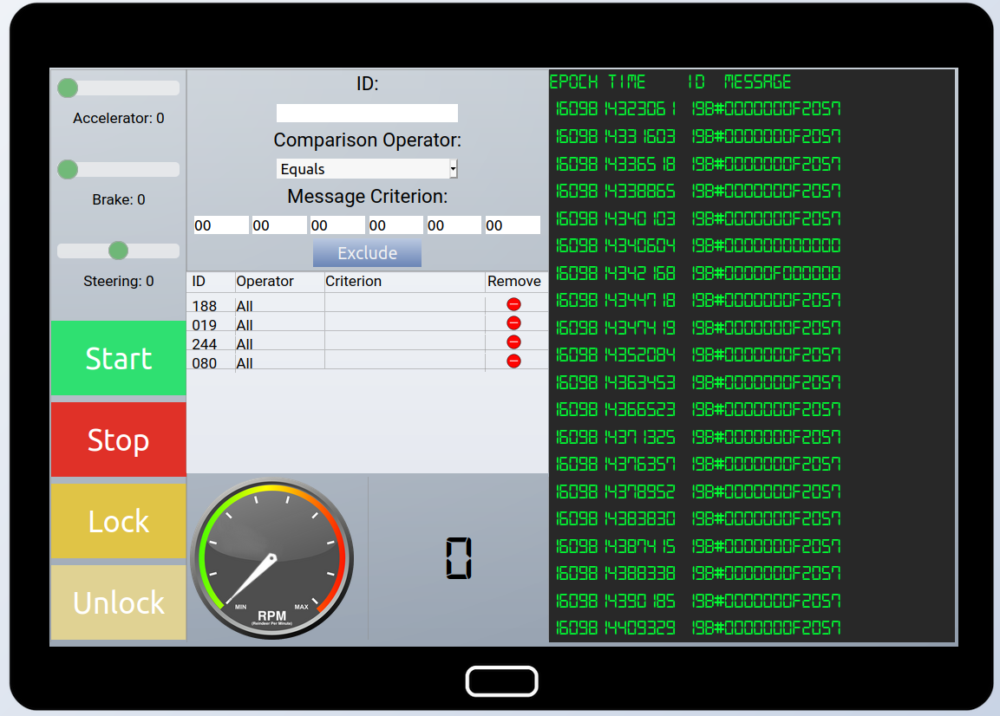
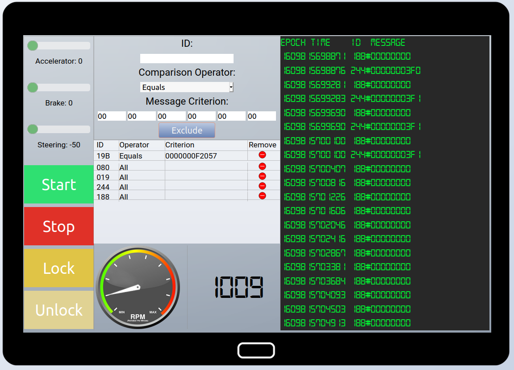
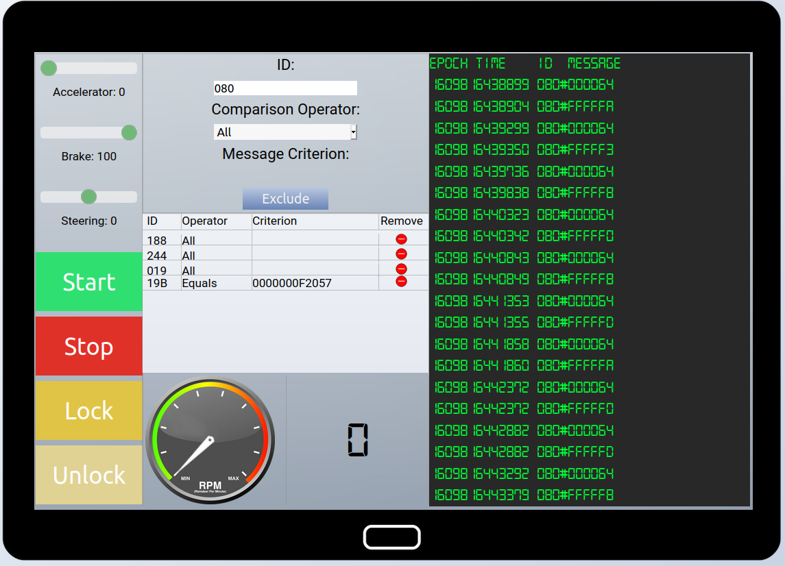
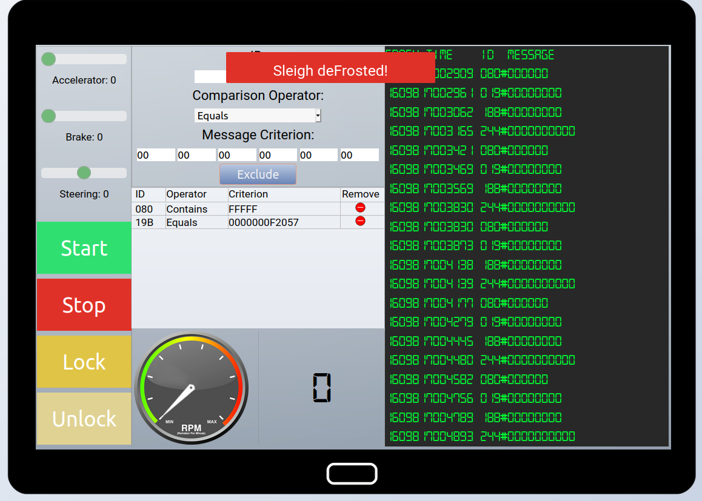

# Solve the Sleigh's CAN-D-BUS Problem

So, Santa suspects **The Lollipop Gang** is attacking his infrastructure, and that his sleigh appears to have been hacked. Coincidence, or the work of the same attackers?

## Objective

> Jack Frost is somehow inserting malicious messages onto the sleigh's CAN-D bus. We need you to exclude the malicious messages and no others to fix the sleigh. Visit the NetWars room on the roof and talk to Wunorse Openslae for hints. 

`Difficulty: 3/5`

## Wunorse Openslae's dialog:
> Say, do you have any thoughts on what might fix Santa's sleigh? 
> Turns out: Santa's sleigh uses a variation of CAN bus that we call CAN-D bus. 
> And there's something naughty going on in that CAN-D bus. 
> The brakes seem to shudder when I put some pressure on them, and the doors are acting oddly. 
> I'm pretty sure we need to filter out naughty CAN-D-ID codes. 
> There might even be some valid IDs with invalid data bytes. 
> For security reasons, only Santa is allowed access to the sled and its CAN-D bus. 
> I'll hit him up next time he's nearby. 

> Hey Santa! 
> Those tweaks you made to the sled just don’t seem right to me. 
> I can’t figure out what’s wrong, but maybe you can check it out to fix it. 

## Hints
> Chris Elgee is talking about how [CAN traffic](https://www.youtube.com/watch?v=96u-uHRBI0I) works right now! 

## Solution

!!! note
    It's helpful to complete the **CAN-BUS Investigation** terminal before attempting this objective.

[CAN Bus](https://en.wikipedia.org/wiki/CAN_bus) is a communication bus designed to allow vehicle microcontrollers and computers to communicate without using a host computer. Devices on the bus communicate via messages that are received by every device on the bus. A rogue or misconfigured device on the bus can cause a vehicle to malfunction. Someone is inserting malicuous messages on the CAN-D bus on Santa's sleigh. From Wunorse's dialog, it appears we need to fix 3 things:

1. The brakes shudder when applied.
2. The doors are acting oddly.
3. Some valid IDs have invalid data.

Using the interface to the CAN-D Bus in the sleigh, we can see the current traffic on the bus. We can simulate the major functions on the sleigh: starting & stopping the engine, locking & locking the doors, and applying the accelerator & brakes. 

A good starting point is to filter out the "noisy" traffic that's making it difficult to find the malicious messages:

By process of elimination, we can determinations on what IDs correspond to what function:

- `080`: Brakes
- `188`: Tachometer (RPM gauge)
- `019`: Steering
- `244`: Accelerator pedal
- `19B`: Locking mechanism (Lock/Unlock)

Filtering out all traffic from IDs `188`, `019`, `244`, and `080` eliminates all the noisy traffic, and allows us to see that there are messages from ID `19B`. There appear to be malicious messages on the bus with `ID 19B`, so can apply a filter to exclude those messages: `ID = 19B:0000000F2057`.

Removing the filter for `ID 080` will allow us to look at the oddly-acting brakes. Applying the brakes to 100, we can see messages of `080:000064` (100 in base 10), but also some errant messages with `ID 080` but values > `FFFFF0`. 

We can apply a filter for `ID 080`, values containing `FFFFF` to eliminate the misbehaving brakes. This last filter fixes Santa's sleigh and solves the objective.

## Answer
Correctly filter the CAN-D Bus traffic to eliminate the problems with the sleigh.
