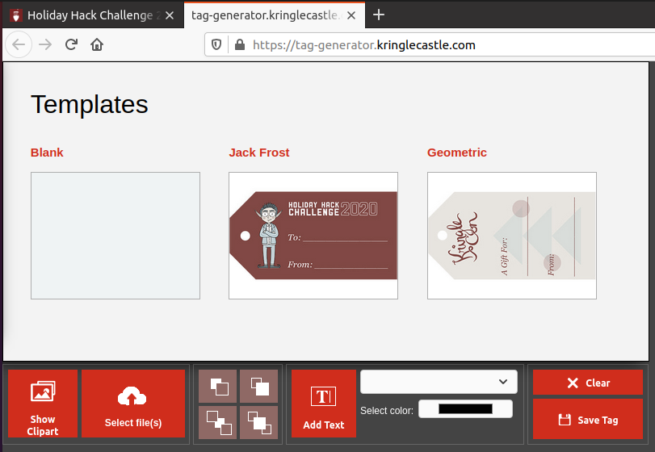
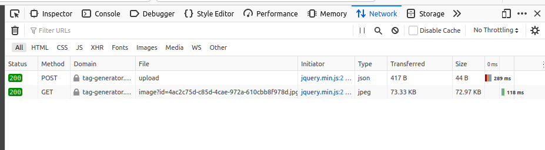
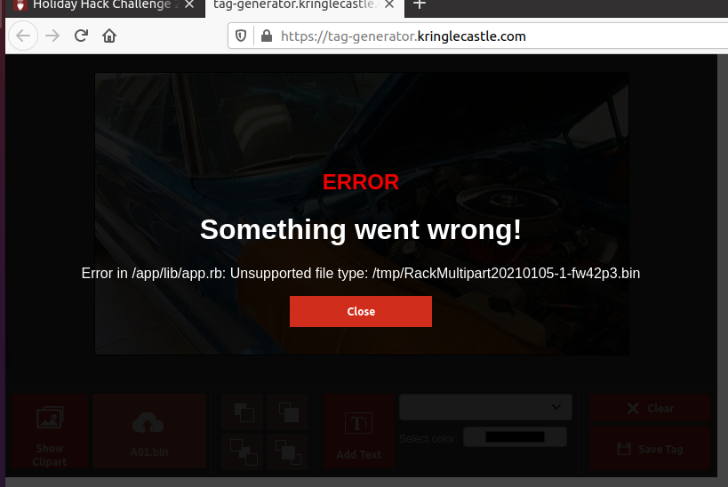
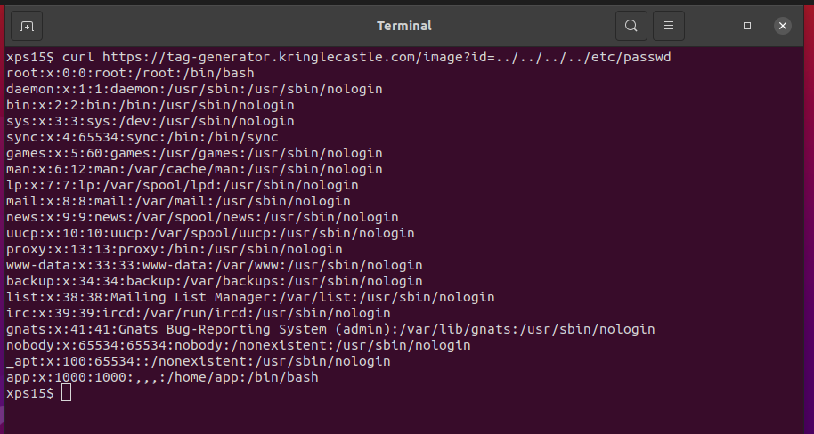
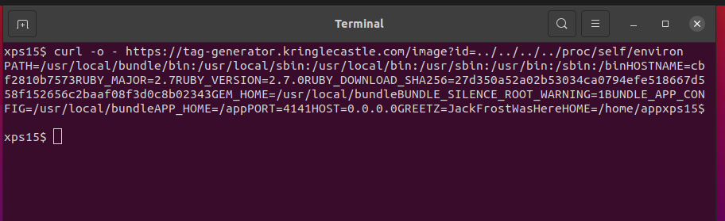

# Broken Tag Generator

## Objective

> Help Noel Boetie fix the [Tag Generator](https://tag-generator.kringlecastle.com/) in the Wrapping Room. What value is in the environment variable GREETZ? Talk to Holly Evergreen in the kitchen for help with this.

`Difficulty: 4/5`

## Holly Evergreen's dialog:
> Hi Santa! 
> If you have a chance, I'd love to get your feedback on the Tag Generator updates! 
> I'm a little concerned about the file upload feature, but Noel thinks it will be fine. 

## Hints
> Is there an endpoint that will print arbitrary files? 
> We might be able to find the problem if we can get source code! 
> Can you figure out the path to the script? It's probably on error pages! 
> Once you know the path to the file, we need a way to download it! 
> If you're having trouble seeing the code, watch out for the Content-Type! Your browser might be trying to help (badly)! 
> I'm sure there's a vulnerability in the source somewhere... surely Jack wouldn't leave their mark? 
> If you find a way to execute code blindly, I bet you can redirect to a file then download that file! 
> Remember, the processing happens in the background so you might need to wait a bit after exploiting but before grabbing the output! 

## Solution

This objective is about web application vulnerabilities. The **[Tag
Generator](https://tag-generator.kringlecastle.com/)** is a web
application to print To:/From: tags for presents:

The objective asks us
to find the content of the `GREETZ` environment variable from the web
application process. From the hints, we'll be looking for two vulerabilities: a
[Local File Inclusion (LFI)](https://owasp.org/www-project-web-security-testing-guide/latest/4-Web_Application_Security_Testing/07-Input_Validation_Testing/11.1-Testing_for_Local_File_Inclusion),
and a [Remote Code Execution (RCE)](https://owasp.org/www-community/attacks/Command_Injection).
Also, Holly has concerns about the 'file upload' function, which is a very typical source of LFI vulnerabilities.

There are at least two paths to solve this objective: a simple LFI, and a longer
path from LFI to RCE. I used the simple path and was able to solve the challenge
with a single request to the web application. I'll detail the longer path later. Some
familiarty with web technologies is expected in this walkthrough.

Either way, we need to watch the traffic between the browser and the web app. A simple
method is to se the Developer Tools in the browser, specifically the `Network` tab. In
there, we can see the requests sent to the web app and the responses. We could also
use a **Man In The Middle** proxy such as [Burp proxy](https://portswigger.net/burp)
or [OWASP ZAP](https://www.zaproxy.org/), setting those up is left as an exercise to
the reader.

Selecting an image and hitting `Upload` in the application gives the following requests
between the brower and the web app:

First, the browser sents an `HTTP POST` request to
`https://tag-generator.kringlecastle.com/upload` with the
picture data in the `POST` body. The next request is an `HTTP GET` to
`https://tag-generator.kringlecastle.com/image?id=4ac2c75d-c85d-4cae-972a-610cbb8f978d.jpg`,
which returns the picture data we just uploaded.

Attempting to send a non-picture file results in an interesting error message:

We can deduce several things from this error:

- The application is written in the **Ruby** programming language, given the file extension of `.rb`.
- Googling the string `RackMultipart` returns several results asking about **Ruby on Rails**, a framework for developing web applications in Ruby.
- Some part of the path to the application path is `/app/lib/app.rb`.
- The application writes temporary files to the directory `/tmp'.
- From the directory names, it's likely the application is running under some flavor of Unix, most likely Linux.

### The 'easy' way

Going back to the successful upload, the `GET` request provides an interesting path
of attack: the `id` parameter. The application writes the uploaded file to `/tmp`,
then returns the filename to the application, which then does a subsequent `GET` with
that filename in the `?id=` parameter. It may be that we can abuse that parameter to
read other files on the host.

A very handy resource for web application testing is [Payloads All The
Things](https://github.com/swisskyrepo/PayloadsAllTheThings). We can look in [File
Inclusion](https://github.com/swisskyrepo/PayloadsAllTheThings/tree/master/File%20Inclusion)
for some ideas on possible paylods to abuse the `id` parameter. Attemping a simple
Path Traversal attack with `curl` in a terminal window yields a positive results:

`curl https://tag-generator.kringlecastle.com/image?id=../../../../etc/passwd` allowed us
to read the password file. We could poke around the filesystem and look for the source
to the application, but the objective is asking us for the content of an environment
variable in the process the application is running. In Linux, the `/proc` filesystem
has information about all the running processes, and the special link `/proc/self`
points to the current process. Inside a `/proc` entry is a special file `environ`, which
contains the environment variables of that process. We can abuse the `id` parameter to
read `/proc/self/environ` and get the environment variables for the web server process:

`curl -o - https://tag-generator.kringlecastle.com/image?id=../../../../proc/self/environ`

We can see the `GREETZ` environment variable is set to `JackFrostWasHere`.

### The 'hard' way

(to be filled in)

## Answer
`JackFrostWasHere`
